# 32_ENTITY_RELATIONSHIP

## Entity Relationship Overview

The database relationships are organized around tenants, sites, content, media, SEO, commerce, and operational tracking. The core ownership model uses `tenants` as a top-level scope and `sites` as site-level boundaries.

## Mermaid ER Diagram

```mermaid
erDiagram
    TENANTS {
        UUID id PK
        TEXT name
        TEXT slug
    }
    SITES {
        UUID id PK
        UUID tenant_id FK
        TEXT name
        TEXT slug
        TEXT domain
    }
    USERS {
        UUID id PK
        UUID tenant_id FK
        TEXT email
    }
    ROLES {
        UUID id PK
        UUID tenant_id FK
        TEXT name
    }
    PERMISSIONS {
        UUID id PK
        TEXT name
        TEXT resource
        TEXT action
    }
    ROLE_PERMISSIONS {
        UUID role_id FK
        UUID permission_id FK
    }
    USER_ROLES {
        UUID user_id FK
        UUID role_id FK
    }
    AUTHORS {
        UUID id PK
        UUID site_id FK
        UUID user_id FK
    }
    CATEGORIES {
        UUID id PK
        UUID site_id FK
        UUID parent_id FK
    }
    TAGS {
        UUID id PK
        UUID site_id FK
    }
    ARTICLES {
        UUID id PK
        UUID site_id FK
        UUID author_id FK
        UUID primary_category_id FK
    }
    ARTICLE_TAGS {
        UUID article_id FK
        UUID tag_id FK
    }
    MEDIA_ASSETS {
        UUID id PK
        UUID site_id FK
        UUID uploaded_by FK
    }
    ARTICLE_MEDIA {
        UUID article_id FK
        UUID media_asset_id FK
    }
    COMMENTS {
        UUID id PK
        UUID article_id FK
        UUID user_id FK
        UUID parent_id FK
    }
    SEO_META {
        UUID id PK
        UUID site_id FK
    }
    REDIRECTS {
        UUID id PK
        UUID site_id FK
    }
    ADS {
        UUID id PK
        UUID site_id FK
    }
    AD_PLACEMENTS {
        UUID id PK
        UUID ad_id FK
    }
    ANALYTICS_EVENTS {
        UUID id PK
        UUID site_id FK
        UUID user_id FK
    }
    SEARCH_LOGS {
        UUID id PK
        UUID site_id FK
    }
    NOTIFICATIONS {
        UUID id PK
        UUID tenant_id FK
        UUID user_id FK
    }
    SETTINGS {
        UUID id PK
        UUID site_id FK
        UUID tenant_id FK
    }
    AI_JOBS {
        UUID id PK
        UUID site_id FK
        UUID requested_by FK
    }
    AI_PROMPTS {
        UUID id PK
        UUID site_id FK
    }
    AUDIT_LOGS {
        UUID id PK
        UUID tenant_id FK
        UUID site_id FK
        UUID user_id FK
    }
    PAGES {
        UUID id PK
        UUID site_id FK
        UUID seo_meta_id FK
    }
    API_KEYS {
        UUID id PK
        UUID tenant_id FK
    }
    SESSIONS {
        UUID id PK
        UUID user_id FK
    }
    REFRESH_TOKENS {
        UUID id PK
        UUID user_id FK
    }
    PASSWORD_RESET_TOKENS {
        UUID id PK
        UUID user_id FK
    }
    EMAIL_VERIFICATIONS {
        UUID id PK
        UUID user_id FK
    }
    MENUS {
        UUID id PK
        UUID site_id FK
    }
    ACTIVITY_LOGS {
        UUID id PK
        UUID site_id FK
        UUID user_id FK
    }

    TENANTS ||--o{ SITES : owns
    TENANTS ||--o{ USERS : contains
    TENANTS ||--o{ ROLES : contains
    TENANTS ||--o{ NOTIFICATIONS : contains
    TENANTS ||--o{ SETTINGS : contains
    TENANTS ||--o{ AUDIT_LOGS : logs
    TENANTS ||--o{ API_KEYS : owns
    SITES ||--o{ AUTHORS : contains
    SITES ||--o{ CATEGORIES : contains
    SITES ||--o{ TAGS : contains
    SITES ||--o{ ARTICLES : contains
    SITES ||--o{ MEDIA_ASSETS : contains
    SITES ||--o{ REDIRECTS : contains
    SITES ||--o{ ADS : contains
    SITES ||--o{ ANALYTICS_EVENTS : contains
    SITES ||--o{ SEARCH_LOGS : contains
    SITES ||--o{ SETTINGS : contains
    SITES ||--o{ AI_JOBS : contains
    SITES ||--o{ AI_PROMPTS : contains
    SITES ||--o{ SEO_META : contains
    SITES ||--o{ PAGES : contains
    USERS ||--o{ USER_ROLES : assigned
    ROLES ||--o{ USER_ROLES : includes
    ROLES ||--o{ ROLE_PERMISSIONS : includes
    PERMISSIONS ||--o{ ROLE_PERMISSIONS : grants
    AUTHORS ||--o{ ARTICLES : writes
    ARTICLES ||--o{ ARTICLE_TAGS : tagged
    TAGS ||--o{ ARTICLE_TAGS : tagged
    ARTICLES ||--o{ ARTICLE_MEDIA : embeds
    MEDIA_ASSETS ||--o{ ARTICLE_MEDIA : used
    ARTICLES ||--o{ COMMENTS : receives
    USERS ||--o{ COMMENTS : writes
    COMMENTS ||--o{ COMMENTS : replies
    ADS ||--o{ AD_PLACEMENTS : placed
    SITES ||--o{ PAGES : contains
    USERS ||--o{ SESSIONS : owns
    USERS ||--o{ REFRESH_TOKENS : owns
    USERS ||--o{ PASSWORD_RESET_TOKENS : owns
    USERS ||--o{ EMAIL_VERIFICATIONS : owns
    SITES ||--o{ MENUS : contains
    SITES ||--o{ ACTIVITY_LOGS : logs
    USERS ||--o{ ACTIVITY_LOGS : performs
```

## Cardinality

- `Tenants` to `Sites`: one-to-many.
- `Tenants` to `Users`: one-to-many.
- `Sites` to `Authors`, `Categories`, `Tags`, `Articles`, `MediaAssets`, `Menus`: one-to-many.
- `Sites` to `ActivityLogs`, `Users` to `ActivityLogs`: one-to-many (both scope columns nullable).
- `Articles` to `Tags`: many-to-many via `article_tags`.
- `Articles` to `MediaAssets`: many-to-many via `article_media`.
- `Articles` to `Comments`: one-to-many.
- `Users` to `Comments`: one-to-many.
- `Users` to `Roles`: many-to-many via `user_roles`.
- `Roles` to `Permissions`: many-to-many via `role_permissions`.

## Ownership

- `Tenants` own `Sites`, `Users`, and tenant-scoped settings. V1 operates in a single-tenant mode with plan for future tenant expansion.
- `Sites` own content and media entities.
- `Articles` own revisions and content-specific associations.
- `Users` own assignments, comments, and audit actions.

## Cascade Behavior

- Site deletion is restricted when content exists; soft delete is preferred.
- Tenant deletion is restricted and should trigger data containment workflows.
- Role deletion cascades `user_roles` and `role_permissions`.
- Article deletion cascades `article_revisions`, `article_tags`, `article_media`, and `comments` if hard deleted.
- Media asset deletion is soft and does not immediately remove article associations.
- Audit logs are retained independently and not cascaded away automatically.
