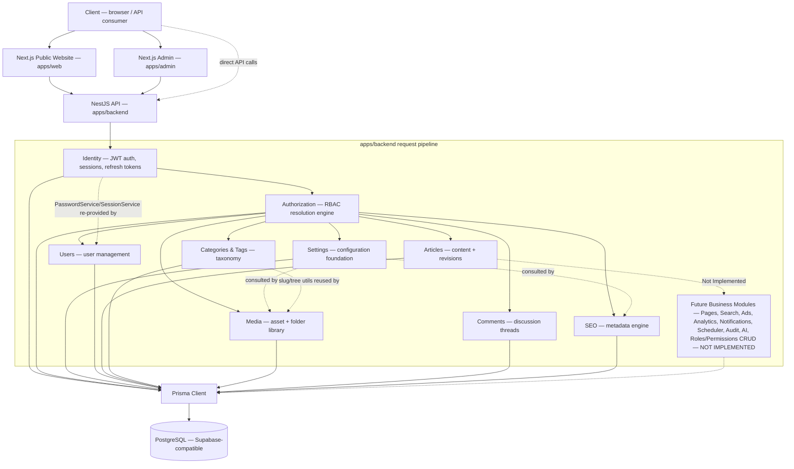
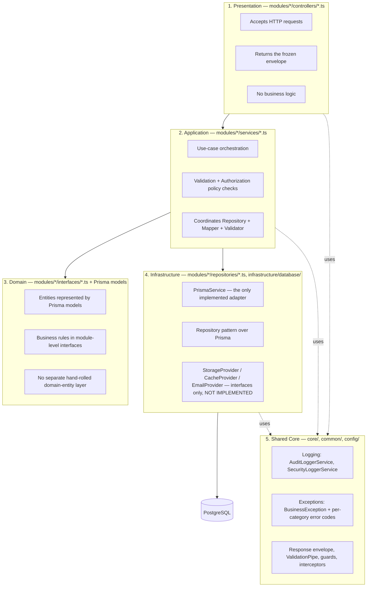

# 44_SYSTEM_OVERVIEW

## Executive Summary

The official architecture overview for the Modern CMS Publishing Platform as of **Milestone 12** (refreshed in a stabilization patch following the Final Backend Architecture Audit — the previous version of this document was stale, self-dated "as of Milestone 7," and listed Articles/Categories/Tags/Media/Comments/SEO as "Not started" despite all six being fully implemented). This document is a synthesis, not a new source of truth — every claim below traces back to one of the frozen or milestone-specific documents listed in "Related Documents." Where this document and a frozen document ever disagree, the frozen document wins and this one should be corrected (per `RULE_ZERO`).

## High-Level System Diagram



This diagram shows dependency/data flow, not literal HTTP routing — every module talks to Prisma directly (each owns its own repositories), not through a chain of module-to-module calls. Dotted edges mark explicit, documented cross-module reuse (never a business-module-to-business-module service call for mutation — see "Module Dependency Diagram" below for the full DI graph). The vertical grouping (Identity/Authorization first, then Settings/Users, then the six content-facing modules) reflects both build order (Milestones 4→12) and typical request dependency (a request is authenticated by Identity, authorized by Authorization, and only then reaches a business module).

## Module Dependency Diagram

Confirmed via the Final Backend Architecture Audit (post-Milestone-12) — a full grep of every module's cross-module imports, checked against each module's own architecture doc for an explicit disclosure. **No circular dependencies exist.**

```mermaid
flowchart LR
    Identity[Identity]
    Authorization[Authorization]
    Settings[Settings]
    Users[Users]
    Articles[Articles]
    Categories[Categories & Tags]
    Media[Media]
    Comments[Comments]
    Seo[SEO]

    Settings --> Authorization
    Users --> Identity
    Users --> Authorization
    Articles --> Authorization
    Categories --> Authorization
    Media --> Authorization
    Media --> Settings
    Comments --> Authorization
    Seo --> Authorization
    Seo --> Settings

    Media -. SlugShapeValidator / category-tree.util .-> Categories
    Users -. PasswordService / SessionService / SessionRepository / RefreshTokenRepository, re-provided .-> Identity
```

Every solid arrow is a NestJS `Module` import (legitimate DI reuse — `AuthorizationModule` for guards/`AuthorizationService`, `SettingsModule` for `SettingsService`, `IdentityModule` for `JwtModule`). Every dotted arrow is a documented concrete-class reuse (a validator or utility function imported directly, not a live service call at request time) — each one is disclosed in its consuming module's own architecture doc (`48_MEDIA_LIBRARY_ARCHITECTURE.md` for the Categories reuse, `42_USER_MANAGEMENT_ARCHITECTURE.md` for the Identity reuse). No business module ever calls another business module's Repository or Service directly to read/write that module's own data — Comments and SEO instead run direct, read-only Prisma existence-checks against Article/User/Category/Page inside their own repositories (see `49_COMMENTS_ARCHITECTURE.md`/`51_SEO_ARCHITECTURE.md` "Conflict Resolution") rather than importing ArticlesModule/UsersModule/CategoriesModule.

## Backend Layer Diagram



This layering is identical across all 9 modules — verified module-by-module in the Final Backend Architecture Audit with zero exceptions (no controller calls Prisma directly, no repository calls a service, no validator calls a repository).

## Project Layers

Per `20_BACKEND_ARCHITECTURE.md` §2, the backend is organized into five layers (see "Backend Layer Diagram" above for the visual):

### 1. Presentation Layer

**Responsibility:** API controllers and route handlers. Accepts HTTP requests, returns responses via the frozen envelope (`core/responses/api-response.ts`). No business logic.
**Implemented as:** `modules/*/controllers/*.ts` — every business module (`AuthController`, `AuthorizationController`, `SettingsController`, `UsersController`, `ArticlesController`, `CategoriesController`/`TagsController`, `MediaController`/`MediaFolderController`, `CommentsController`/`ArticleCommentsController`/`UserCommentsController`, `SeoController`).

### 2. Application Layer

**Responsibility:** Use cases and orchestration — coordinates validation, authorization, persistence, and (future) events for a business process.
**Implemented as:** `modules/*/services/*.ts` — one primary service per resource across all 9 modules, each instantiating and consulting its resource's ownership/taxonomy policy before a mutation (`ArticleOwnershipPolicy`, `TaxonomyPolicy`, `MediaOwnershipPolicy`, `CommentOwnershipPolicy` — SEO has no ownership policy, role/permission-gated only, matching Categories/Tags' "no ownership branch" precedent).

### 3. Domain Layer

**Responsibility:** Entities, value objects, business rules — framework-agnostic.
**Implemented as:** Currently thin — most "domain" concepts are represented directly by Prisma models plus module-level interfaces (`modules/*/interfaces/*.ts`) rather than a separate hand-rolled domain-entity layer. This is a pragmatic reflection of the codebase's actual state through Milestone 12, not a claim that a richer domain layer exists.

### 4. Infrastructure Layer

**Responsibility:** Database persistence, external adapters (cache, queue, storage, email, search, AI — all still interface-only or unimplemented through Milestone 12).
**Implemented as:** `infrastructure/database/prisma.service.ts` (the only implemented adapter), `core/interfaces/*` (event bus, email provider, storage provider, cache provider — interfaces only), `modules/*/repositories/*.ts` (repository pattern over Prisma, one or two repositories per module).

### 5. Shared Core

**Responsibility:** Cross-cutting concerns — logging, configuration, error handling, validation, security utilities — consumable by every layer.
**Implemented as:** `core/` (logger, exceptions, responses, feature-flags), `common/` (guards, interceptors, filters, pipes, dto), `config/` (typed env configuration).

## Request Lifecycle

Per `20_BACKEND_ARCHITECTURE.md` §8, as actually implemented through Milestone 12 (unchanged in substance since Milestone 7 — no new global guard/interceptor/pipe was added by any content module):

```
1. Request enters Fastify, middleware assigns requestId/correlationId
2. Global guards run: ThrottlerGuard, then JwtAuthGuard (both APP_GUARD, always run —
   confirmed still exactly these two in app.module.ts through Milestone 12, no
   PermissionGuard/RoleGuard/AuthorizationGuard was ever added globally)
3. Route-level guards run, if present: PermissionGuard / RoleGuard / AuthorizationGuard
   (opt-in only — @UseGuards(), never global; @RequirePermission()/@RequireRole() supply metadata)
4. AppValidationPipe validates the request body/query against the controller's DTO
   (whitelist + forbidNonWhitelisted — unknown/extra fields are rejected, preventing
   mass-assignment of fields like id/createdAt/deletedAt from a client payload)
5. Controller delegates to its module's Service
6. Service coordinates: repository calls, cross-module reads (e.g. Users reusing
   Identity's PasswordService/SessionService; Comments/SEO running direct existence-
   checks against Article/User/Category/Page tables), validators, mappers, ownership
   policies
7. Repository executes Prisma queries against PostgreSQL
8. Service returns a plain object or PaginatedResult<T>
9. ResponseInterceptor wraps it in the frozen { success, message, data, meta, errors } envelope
   (recognizing PaginatedResult specially, to populate meta.pagination)
10. GlobalExceptionFilter transforms any thrown exception into the same envelope shape,
    logging security-relevant codes via SecurityLoggerService
```

## Authentication Flow

```
POST /auth/login (public)
  → AuthService verifies credentials via PasswordService.compare()
  → TokenService.signAccessToken() — JWT, 4 claims only (sub, email, role: null, siteId)
  → SessionService.createSession() — creates RefreshToken + Session together
  → Response: { accessToken, refreshToken, expiresIn }

Every subsequent request:
  → JwtAuthGuard (global) extracts the Bearer token
  → JwtStrategy.validate() re-queries the User by `sub` from the DATABASE (never trusts token claims
    for anything beyond `sub`) — a deleted/suspended user is rejected even with a valid token
  → request.user = AuthenticatedUser (fresh DB row, not decoded claims)

POST /auth/refresh:
  → SessionService.rotateSession() — old token+session revoked, new pair issued
  → Reuse of an already-rotated token is rejected (no blacklist needed — rotation is self-cleaning)
```

Full detail: `docs/37_IDENTITY_FREEZE.md`.

## Authorization Flow

```
Route declares @RequirePermission(...) / @RequireAnyPermission(...) / @RequireAllPermissions(...) / @RequireRole(...)
  → read by PermissionGuard / RoleGuard / AuthorizationGuard (opt-in, @UseGuards() per route)
  → no metadata on the route → guard allows (no-op)
  → metadata present, no request.user → deny
  → AuthorizationService.hasPermission()/.hasRole()/etc.
      → UserRoleRepository.findRoleNamesForUser() (direct roles)
      → resolveRoleHierarchy() (in-code transitive closure, no DB call)
      → RolePermissionRepository.findPermissionKeysForRoleNames() (flat permission set)
  → true/false, computed fresh from the database every call (no cache — AuthorizationCacheProvider
    is interface-only, per the Milestone 5 conflict entry in 43_CONFLICT_RESOLUTION.md)
```

Every content module (Articles, Categories/Tags, Media, Comments, SEO) reuses this exact engine — none has invented its own permission-resolution logic. Where the frozen `PERMISSIONS` vocabulary has no fine-grained key for a module's resource (no `article.view`, no `category.update`/`delete`, no `tag.*`, no `media.view`/`restore`, no `comment.create`/`update`/`delete`, no `seo.view`/`create`/`update`/`delete`/`publish`), each module documents the gap and reuses its coarsest existing key rather than inventing one — see `43_CONFLICT_RESOLUTION.md`'s Cross-Cutting Pattern #4.

Full detail: `docs/38_RBAC_ARCHITECTURE.md`.

## Database Flow

```
Service → Repository (modules/*/repositories/*.ts) → PrismaService → PostgreSQL (Supabase-compatible, no vendor lock-in)
```

- `PrismaService` (`infrastructure/database/prisma.service.ts`) connects lazily — `/health`/`/live` never depend on database reachability; only `/ready` does. This lazy-connect behavior is also what allows a full `NestFactory.create(AppModule)` boot (used to live-verify Swagger in Milestones 11/12's stabilization patches) to succeed without a reachable database.
- All persistence goes through Prisma's generated client against `config/prisma/schema.prisma` — 37 frozen models (`36_DATABASE_FREEZE.md`), unchanged in count through Milestone 12 (no content module added, removed, or altered a model, enum, or migration — every module reused the existing frozen schema).
- Soft delete is the standard pattern (`deletedAt`/`deletedBy` audit columns) for every primary entity; hard delete is reserved for append-only logs (`ArticleRevision`, `AnalyticsEvent`, `AuditLog`, `ActivityLog`).
- Where the frozen schema has no column for a module's needs, the module reuses an existing generic `Json?` column instead of requesting a migration — Settings reused `Setting.value`, Users reused `User.metadata`, Media reused `MediaAsset.metadata` (for `folderId`/`filename`) — see `43_CONFLICT_RESOLUTION.md`'s "Cross-Cutting Patterns."
- **Known, documented application-layer-only uniqueness gaps** (no DB-level `@@unique` constraint, checked only in the service layer, all disclosed in `43_CONFLICT_RESOLUTION.md`): Settings' Global scope, `User.email`/`username`, and — found by the Final Backend Architecture Audit — `Category.name`/`Tag.name`. Slug/storageKey/email-verification-token style fields correctly DO have real partial unique indexes; only free-text "name"/"Global scope" style fields have this gap.

## Configuration Flow

```
Runtime Override (in-process, e.g. SettingsService.setRuntimeOverride — no REST endpoint yet)
      ↓
Environment Variable (config/env/{development,staging,production,test}.env, loaded via AppConfigService)
      ↓
Database Setting (Setting table row, resolved via SettingsService — Milestone 6)
      ↓
System Default (SettingDefinition.defaultValue, code-level registry)
```

Two parallel configuration systems continue to coexist by design through Milestone 12:

1. **`AppConfigService`** (`config/config.service.ts`) — typed facade over `@nestjs/config`, validated at boot by `env.validation.ts` (fails fast on a missing/malformed required variable). Used for infrastructure-level config (`DATABASE_URL`, `JWT_SECRET`, `PORT`, etc.) that must be known before the app can even start.
2. **`SettingsService`** (Milestone 6) — the four-tier priority chain above, for anything an operator might want to change without redeploying (feature flags, site name, SEO defaults, etc.).

Feature flags flow through both: `FeatureFlagsService` delegates to `SettingsService`, which itself consults the env var as one of its four tiers. **New in Milestone 10/12:** Media reuses `SettingCategory.MEDIA`'s `maxUploadSizeMb`/`allowedMimeTypes`, and SEO reuses `SettingCategory.SEO`'s `defaultMetaTitle`/`defaultMetaDescription` (for its preview endpoint's fallback) — both are additional, real consumers of `SettingsService.getByKey()`/`resolveValue()` beyond Milestone 6's own Settings-internal usage, confirming the priority chain generalizes correctly to other modules.

## Module Inventory (as of Milestone 12)

| Module                                                                                                      | Milestone | Status                                 | Notes                                                                                                                                                                                                                                                                |
| ----------------------------------------------------------------------------------------------------------- | --------- | -------------------------------------- | -------------------------------------------------------------------------------------------------------------------------------------------------------------------------------------------------------------------------------------------------------------------- |
| `modules/identity/`                                                                                         | 4 / 4.1   | **Frozen**                             | JWT auth, sessions, refresh tokens                                                                                                                                                                                                                                   |
| `modules/authorization/`                                                                                    | 5         | **Frozen**                             | RBAC resolution engine                                                                                                                                                                                                                                               |
| `modules/settings/`                                                                                         | 6         | Implemented, awaiting approval         | Configuration foundation                                                                                                                                                                                                                                             |
| `modules/users/`                                                                                            | 7         | Implemented, awaiting approval         | User management                                                                                                                                                                                                                                                      |
| `modules/articles/`                                                                                         | 8         | Implemented, awaiting approval         | Content + revisions + SEO upsert                                                                                                                                                                                                                                     |
| `modules/categories/` (Category + Tag)                                                                      | 9         | Implemented, awaiting approval         | Taxonomy, tree, SEO upsert                                                                                                                                                                                                                                           |
| `modules/media/` (Asset + Folder)                                                                           | 10        | Implemented, awaiting approval         | Asset/folder library, no upload engine                                                                                                                                                                                                                               |
| `modules/comments/`                                                                                         | 11        | Implemented, awaiting approval         | Threaded discussion, moderation                                                                                                                                                                                                                                      |
| `modules/seo/`                                                                                              | 12        | Implemented, awaiting approval         | Standalone SeoMeta CRUD, preview, validate                                                                                                                                                                                                                           |
| `modules/health/`                                                                                           | 2.1       | Implemented (part of core scaffolding) | `/health`, `/live`, `/ready`                                                                                                                                                                                                                                         |
| Pages, Search, Ads, Analytics, Notifications, Scheduler, Audit (DB persistence), AI, Roles/Permissions CRUD | —         | **NOT IMPLEMENTED**                    | Named in `20_BACKEND_ARCHITECTURE.md` §4's module list; no code exists for any of these. `Page`/`Sitemap`/`Redirect`/`AuditLog`/`AiJob` models exist in the frozen schema (reserved, per `36_DATABASE_FREEZE.md`) but have zero repository/service/controller today. |

**Business-module count: 9 implemented, 1 frozen-foundation pair (Identity+Authorization) + 7 not-yet-started.** No module listed as "Not started" was touched, stubbed, or partially implemented by any milestone through 12 — each remains exactly absent, not half-built.

## Related Documents

- `docs/20_BACKEND_ARCHITECTURE.md` — layer/lifecycle definitions this document summarizes.
- `docs/35_ARCHITECTURE_FREEZE.md` — final module list and technology stack.
- `docs/36_DATABASE_FREEZE.md` — schema this document's "Database Flow" section describes.
- `docs/37_IDENTITY_FREEZE.md`, `docs/38_RBAC_ARCHITECTURE.md`, `docs/39_SETTINGS_ARCHITECTURE.md`, `docs/42_USER_MANAGEMENT_ARCHITECTURE.md`, `docs/46_ARTICLES_ARCHITECTURE.md`, `docs/47_CATEGORY_TAG_ARCHITECTURE.md`, `docs/48_MEDIA_LIBRARY_ARCHITECTURE.md`, `docs/49_COMMENTS_ARCHITECTURE.md`, `docs/51_SEO_ARCHITECTURE.md` — per-module detail behind each Flow section above and the Module Inventory table.
- `docs/43_CONFLICT_RESOLUTION.md` — why several of the flows above look the way they do (e.g. the four-tier configuration chain, the reused-JSON-column pattern, every module's permission-vocabulary gaps), now updated through Milestone 12.
- `docs/45_PROJECT_FREEZE_V1.md` — what's completed vs. pending vs. deferred across this whole module inventory, now also refreshed through Milestone 12.
- `docs/50_V1_PRODUCT_SCOPE.md` — the official V1 scope freeze (previously misfiled as `docs/product scop.md`; renamed in this same stabilization patch — see `43_CONFLICT_RESOLUTION.md`'s Milestone 11 entry).

## Approved Date

Pending — part of the same stabilization patch as `43_CONFLICT_RESOLUTION.md`, `45_PROJECT_FREEZE_V1.md`, and `docs/README.md`. Refreshed through Milestone 12 in a second stabilization patch, post-Final-Backend-Audit.

## Architecture Status

**DOCUMENTATION CONSOLIDATION — AWAITING APPROVAL.** Now accurately reflects the system through Milestone 12 (previously stale at Milestone 7).
