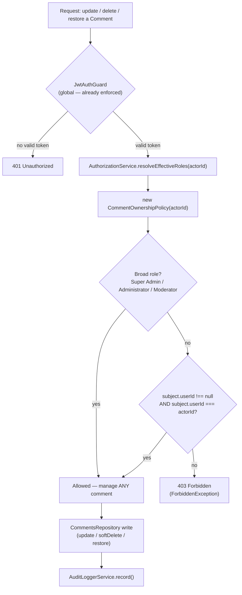

# 49_COMMENTS_ARCHITECTURE

## Executive Summary

Comments & Discussion Foundation (Milestone 11). Mirrors `48_MEDIA_LIBRARY_ARCHITECTURE.md`'s role for its module: from this point forward, `apps/backend/src/modules/comments/` is the literal implementation of what this document describes. **Backend foundation only** — no realtime, no WebSocket, no notifications, no moderation dashboard UI, no frontend.

Identity (Milestone 4), Authorization/RBAC (Milestone 5), Settings (Milestone 6), Users (Milestone 7), Articles (Milestone 8), Categories/Tags (Milestone 9), and Media (Milestone 10) already existed. This module is the first to give the previously interface-only `CommentPolicy` (`38_RBAC_ARCHITECTURE.md`) a real implementation, and reads/writes the `Comment` table for the first time since it was frozen in Milestone 3.

**Architecture Status at time of writing: awaiting approval** (consistent with Milestones 6–10, none of which are marked `FROZEN` the way Milestones 3–5 are).

**Stabilization patch (post-Milestone-11, pre-Milestone-12):** re-verified every cross-reference in this document (see "Cross-Reference Verification" below), added a "Future Enhancements" register, an Ownership Flow diagram, and an explicit Comment Depth Strategy section. No code, schema, API, or permission changed by this patch — documentation and verification only.

## Folder Structure

```
comments/
├── controllers/   — CommentsController (/comments), ArticleCommentsController (/articles/:articleId/comments),
│                    UserCommentsController (/users/:userId/comments)
├── services/      — CommentsService (the single orchestrator)
├── repositories/  — CommentsRepository (Comment CRUD + direct existence checks against Article/User)
├── validators/    — CommentsValidator (body sanitize/length, parent-article match, cycle guard)
├── mappers/       — CommentsMapper (Comment -> response DTO; flat list -> nested tree DTO)
├── policies/      — CommentOwnershipPolicy (first concrete implementation of CommentPolicy)
├── interfaces/    — CommentQueryFilters/Options, MentionParser (interface-only placeholder)
├── constants/      — CommentSortField, body/reason length limits
├── exceptions/    — CommentNotFoundException and 9 others
├── utils/         — sanitize-body.util.ts, comment-tree.util.ts
├── dto/           — 8 files
└── comments.module.ts
```

## Conflicts Found (reported before implementation, summarized here for the record)

1. **`docs/50_V1_PRODUCT_SCOPE.md` does not exist.** The milestone brief's Rule Zero required-reading list names it, and the stabilization patch explicitly asks this document to reference it. Re-checked at patch time (`ls docs/`): the directory still has no file numbered `50` — this document (`49`) remains the highest-numbered doc. This document therefore references `docs/50_V1_PRODUCT_SCOPE.md` here, by name, as a **known-missing dependency**, exactly as Rule Zero requires ("report every conflict before implementation") — it does not fabricate the file's content, since inventing a scope document's contents would itself violate Rule Zero's "never silently modify any frozen architecture" spirit by asserting a scope decision no one approved. Every other required document (`35`–`48`) exists and none of them references a `50` doc as a dependency, so this gap has not blocked any implementation decision so far. **Action for a human maintainer:** either author `docs/50_V1_PRODUCT_SCOPE.md` and update this reference to a real cross-check, or renumber/retire the Rule Zero reading list entry that names it.
   - **RESOLVED (post-Milestone-12 audit stabilization patch):** the content was never actually missing — it existed the entire time under a typo'd filename, `docs/product scop.md` (its own first line literally read `# 50_V1_PRODUCT_SCOPE.md`, status `FROZEN`). The Final Backend Architecture Audit (post-Milestone-12) caught this via a full-content read rather than an exact-filename `ls` check. The file has been renamed to `docs/50_V1_PRODUCT_SCOPE.md` with zero content changes. This conflict entry is retained, unedited, for historical accuracy — this resolution note is appended, not a rewrite — per Rule Zero.
2. **No `comment.create`/`comment.update`/`comment.delete`/`comment.restore` permission exists.** The frozen `PERMISSIONS` vocabulary (`38_RBAC_ARCHITECTURE.md`) has exactly one comment-related key: `COMMENT_MODERATE: 'comment.moderate'`. Gating comment _creation_ behind a moderator-tier permission would prevent the very readers/authors the brief's "Author" ownership tier describes from ever commenting. Resolved by treating create/read/update-own/delete-own/restore-own as **self-service** — gated only by the existing global `JwtAuthGuard` (no extra permission), exactly mirroring the Users module's precedent (`42_USER_MANAGEMENT_ARCHITECTURE.md`: "acting on one's own record isn't managing users"). Only Approve/Reject/Spam are gated by the real `comment.moderate` permission. See "Permission Flow" below.
3. **The brief's four ownership tiers name "Author, Moderator, Administrator, Super Admin."** Unlike Articles/Media (which include Editor in their broad-access tier because taxonomy/content management is editorial), Comments' broad tier is `[Super Admin, Administrator, Moderator]` — Editor is deliberately excluded, since comment moderation is a distinct concern from content editing and the brief does not name Editor for this resource.
4. **`Comment.userId` is nullable** (schema supports anonymous comments via `authorName`/`authorEmail`). Since `POST /comments` requires the global `JwtAuthGuard` like every other endpoint in this codebase (no `@Public()` bypass was requested or precedented), this API never populates `authorName`/`authorEmail` and never creates a `userId: null` comment. Guest/anonymous commenting is schema-supported but **not reachable via this milestone's API** — documented, not silently implemented. A comment with `userId: null` can still exist (e.g. a future public-facing endpoint, or direct DB insertion) and is correctly handled by `CommentOwnershipPolicy` (only a broad-role actor can manage it, since there's no account to match).
5. **"Depth validation" (Validation section) vs. "Unlimited depth" (Replies section) are in tension.** Resolved in favor of "Unlimited depth" (the more specific, explicit requirement): no maximum-depth check exists. "Depth validation" is satisfied by the _other_ listed rules — parent existence, parent-belongs-to-same-article, and a defensive circular-reference guard (`CommentsValidator.assertNoCycle`) — not by capping nesting level.
6. **Circular prevention is structurally unreachable via the current API**, since no "change parent" operation exists (creation always assigns a brand-new id that cannot already be an ancestor of anything). `CommentsValidator.assertNoCycle()`/`utils/comment-tree.util.ts`'s `wouldCreateCommentCycle()` are implemented and unit-tested anyway, as defense-in-depth for a future parent-reassignment feature, matching the "document future hook points" spirit applied elsewhere in this milestone.
7. **The generic hierarchy utility (`modules/categories/utils/category-tree.util.ts`, genericized in Milestone 10 for `MediaFolder`) requires a `HierarchyNode` shape with `name`/`slug`.** `Comment` has neither. Rather than force fake fields onto an unrelated model, a small Comment-specific equivalent (`utils/comment-tree.util.ts`) was written instead of extending the shared generic further.
8. **"HTML sanitization hook"** — `Comment.body` has no rich-text/HTML flag anywhere in the frozen schema (plain `String`). Rather than build a hook interface with no implementation (which would leave the door open to unsanitized HTML being persisted — a real XSS risk), this milestone implements an actual sanitizer (`utils/sanitize-body.util.ts`) that strips all markup, treating comments as plain text. This is stricter than "hook" but avoids shipping a documented-but-inert security gap.
9. **"Mention parser placeholder"** — implemented as `interfaces/mention-parser.interface.ts`, a pure interface with zero implementation and zero DI binding, mirroring the `EmailProvider`/`StorageProvider` pattern from `37_IDENTITY_FREEZE.md`/`48_MEDIA_LIBRARY_ARCHITECTURE.md`.
10. **Event Bus** — no implementation, per instruction. Future hook points are documented in "Future Integrations" below only.
11. **`GET /articles/:id/comments` and `GET /users/:id/comments`** are implemented as two small additional controllers _inside_ this module (`ArticleCommentsController`, `UserCommentsController`) rather than by editing the frozen `ArticlesController`/`UsersController` — the same "add a sibling controller within the owning module" pattern Media used for `MediaFolderController` alongside `MediaController`.
12. **"CommentListDto"** — no separate class was created. List responses reuse the shared `PaginatedResult<CommentResponseDto>` contract (`common/dto/pagination.dto.ts`) plus `CommentQueryDto`, exactly like every other list endpoint in this codebase (Articles/Categories/Media never created a redundant `*ListDto` either).
13. **Article/User existence checks** query `Article`/`User` directly from `CommentsRepository` rather than importing `ArticlesModule`/`UsersModule`, mirroring how Articles validated Category/Tag/Author existence directly instead of importing those modules' repositories.

## Comment Flow

```
POST /comments
  → validate the article exists (direct query)
  → sanitize + validate body (strip HTML, non-empty, length-bounded)
  → if parentId given: validate the parent exists AND belongs to the same article
  → create Comment (status = PENDING, userId = caller)
  → audit log

GET /comments | /comments/:id | /articles/:id/comments | /users/:id/comments
  → read-only, JwtAuthGuard only — non-moderators are always restricted to status=APPROVED
    regardless of any requested status filter; comment.moderate holders may request any status
    (or omit the filter to see all statuses)

PATCH /comments/:id → CommentOwnershipPolicy.canUpdate() → sanitize + re-validate body → update → audit log
DELETE /comments/:id → reject if already deleted → CommentOwnershipPolicy.canDelete() → soft-delete → audit log
POST /comments/:id/restore → reject if not deleted → same ownership check → restore → audit log
```

## Reply Flow

`Comment.parentId` (self-relation, `onDelete: Cascade`) is the only hierarchy relation in the frozen schema. Unlimited depth, satisfied without recursive SQL — `CommentsRepository.findAllForArticle()` fetches an article's active comments in one flat query, and `utils/comment-tree.util.ts`'s `buildCommentTree()` nests them in memory (same "fetch flat, nest in memory" strategy Categories/Media established for their own hierarchies).

- **`GET /comments/:id/replies`** — direct replies only (one level), paginated, same list machinery as every other list endpoint.
- **`GET /articles/:id/comments/tree`** — the full nested tree for an article, unlimited depth, not paginated (a site's per-article comment count is expected to stay small enough for this, matching the same assumption Categories/Media make about their own hierarchies).
- **`replyCount`** on every response DTO is the count of _direct_ children only, computed live (`countDirectReplies`/derived from the flat list for tree responses) — never stored.

## Status Flow

Frozen `CommentStatus` enum only: `PENDING, APPROVED, REJECTED, SPAM` (no new values invented). "Deleted" is never a status value — soft delete uses `deletedAt`/`deletedBy`, exactly like every other frozen table.

```
PENDING  ──(POST /comments/:id/approve, comment.moderate)──►  APPROVED
PENDING  ──(POST /comments/:id/reject,  comment.moderate)──►  REJECTED   (reason required)
PENDING  ──(POST /comments/:id/spam,    comment.moderate)──►  SPAM
```

A comment may be re-moderated from any status to any other (e.g. `APPROVED` → `SPAM` if flagged later) — no state-machine restriction is imposed beyond what the three dedicated endpoints naturally express, since the brief does not specify one.

## Permission Flow

| Action                                                                                              | Permission                                | Ownership Policy?                                                                |
| --------------------------------------------------------------------------------------------------- | ----------------------------------------- | -------------------------------------------------------------------------------- |
| Create own comment                                                                                  | none — `JwtAuthGuard` only (self-service) | No (nothing to own yet)                                                          |
| List / Get by id / List replies / List article comments / List user comments / Article comment tree | none — `JwtAuthGuard` only                | No — but non-moderators are always restricted to `APPROVED` (see "Comment Flow") |
| Update own comment                                                                                  | none — `JwtAuthGuard` only                | Yes — `CommentOwnershipPolicy.canUpdate`                                         |
| Delete / Restore own comment                                                                        | none — `JwtAuthGuard` only                | Yes — `CommentOwnershipPolicy.canDelete` (restore reuses the update-tier check)  |
| Approve / Reject / Spam                                                                             | `comment.moderate`                        | No — moderation-tier action, not ownership-tier                                  |

`CommentOwnershipPolicy` (first real implementation of `CommentPolicy`) rules:

- **Super Admin, Administrator, Moderator** — may update/delete _any_ comment, regardless of who wrote it.
- **Everyone else** — may update/delete only their own comment (`Comment.userId === actor.id`).
- A comment with `userId: null` (schema-supported guest comment, not reachable via this API — see Conflict #4) can only be managed by a broad-role actor.

## Validation Rules

- **Body** — sanitized (all HTML tags stripped, treated as plain text — see Conflict #8), then length-bounded (1–5000 characters after sanitization). A comment that was only markup (e.g. `<script></script>`) is rejected as empty.
- **Article exists** — `CommentsRepository.articleExists()`, direct query, excludes soft-deleted articles.
- **Parent exists** — `findById()` excludes soft-deleted rows by default, so a soft-deleted parent is simply "not found" (`ParentCommentNotFoundException`).
- **Parent belongs to the same article** — `CommentsValidator.assertParentBelongsToArticle()`; cross-article reply threads are rejected (`ParentCommentArticleMismatchException`).
- **Depth** — unconstrained by design (see Conflict #5).
- **Circular prevention** — `assertNoCycle()`/`wouldCreateCommentCycle()`, defense-in-depth only (see Conflict #6).
- **HTML sanitization hook** — a real sanitizer, not a stub (see Conflict #8).
- **Mention parser placeholder** — interface only, zero implementation (see Conflict #9).

## Ownership Rules

See "Permission Flow" above. `CommentPolicySubject` (`{ userId: string | null }`, frozen in `38_RBAC_ARCHITECTURE.md`) required no extension — `Comment.userId` already references `User.id` directly, the same "no indirection" shape Media's `MediaAsset.uploadedBy` had (unlike Article's `Author.userId` indirection).

## Ownership Flow (Diagram)



A comment with `userId: null` (schema-supported guest comment — see Conflict #4) can never satisfy the "yes" branch of `F`, since there is no account to match; only a broad-role actor (the `E` "yes" branch) can manage it.

## Comment Depth Strategy

**Architecture supports unlimited nesting.** `Comment.parentId` is a plain self-relation with no depth/level column anywhere in the frozen schema, and `utils/comment-tree.util.ts`'s `buildCommentTree()`/`getCommentDescendants()` are recursive, in-memory, and have no depth ceiling — a reply chain of any length nests correctly (verified in `comment-tree.util.spec.ts`, e.g. the `a` → `a1` → `a1a` three-level case).

**Current validator limitation: none.** `CommentsValidator` has no `assertMaxDepth()`/equivalent method, and no endpoint or DTO accepts or enforces a depth parameter. This was a deliberate decision, not an oversight — re-confirmed at this stabilization patch by re-reading `CommentsValidator`, `CommentsService.createComment()`, and `CreateCommentDto`: none of the three reference depth at all.

**Reason:** the milestone brief's Replies section explicitly requires "Unlimited depth," which is a more specific and more recent instruction than the Validation section's generic "Depth validation" bullet (see Conflict #5). Depth validation is satisfied by the _other_ rules already enforced on every reply — parent existence (`ParentCommentNotFoundException`), parent-belongs-to-the-same-article (`ParentCommentArticleMismatchException`), and the defensive circular-reference guard (`assertNoCycle`/`wouldCreateCommentCycle`, unreachable via the current API since no parent-reassignment endpoint exists — see Conflict #6) — not by capping how many levels a thread may nest.

This remains a conscious trade-off, not a defect: a pathological thread could nest arbitrarily deep (see "Limitations" below, unchanged by this patch). If abuse is observed in production, a `COMMENT_MAX_DEPTH` constant and an `assertMaxDepth()` check could be added to `CommentsValidator` additively, without any schema change (depth would be computed via `getCommentDescendants`'s companion ancestor-walk, not a stored column) — this is not implemented now, per this patch's "do not implement new features" instruction.

## Future Enhancements

Every item below is **NOT IMPLEMENTED**. Listed for future-milestone planning only — no code, interface, or schema exists for any of them today, and none is implied by anything already built:

| Enhancement         | Status                                                                                                                                                                                              |
| ------------------- | --------------------------------------------------------------------------------------------------------------------------------------------------------------------------------------------------- |
| Markdown Support    | NOT IMPLEMENTED                                                                                                                                                                                     |
| Rich Text Comments  | NOT IMPLEMENTED                                                                                                                                                                                     |
| Mention Parser      | NOT IMPLEMENTED — an interface-only placeholder exists (`interfaces/mention-parser.interface.ts`, see Conflict #9), but zero implementation and zero DI binding                                     |
| Emoji Support       | NOT IMPLEMENTED                                                                                                                                                                                     |
| Anonymous Comments  | NOT IMPLEMENTED — schema supports it (`authorName`/`authorEmail`), API does not expose it (see Conflict #4)                                                                                         |
| Guest Comments      | NOT IMPLEMENTED — same schema/API gap as Anonymous Comments above                                                                                                                                   |
| Thread Collapse     | NOT IMPLEMENTED — this is a presentation/UI concern with no backend component; `replyCount` (already returned) is the only signal a future frontend would need                                      |
| Comment Reactions   | NOT IMPLEMENTED — `Comment.votes: Int` exists in the frozen schema and is exposed read-only, but no reaction types (like/love/etc.) or increment endpoint exist (see "Future Integrations" → Votes) |
| Comment Attachments | NOT IMPLEMENTED — no `Comment` ↔ `MediaAsset` relation exists in the frozen schema; adding one would be a schema change, out of scope for this module and this patch                                |

## Repository Summary

`CommentsRepository` — full `Comment` CRUD, no schema change:

- `articleExists`/`userExists` — direct existence checks against `Article`/`User` (excluding soft-deleted rows).
- `findById(id, includeDeleted?)`, `findMany(options)` (filtered/sorted/paginated), `findAllForArticle(articleId)` (flat, for tree building), `countDirectReplies`/`findDirectReplies`.
- `create`, `update`, `softDelete`, `restore` — same shape as every other frozen-table repository in this codebase.

## Service Summary

`CommentsService` — all business logic, no Prisma in the controller layer:

- Orchestrates validation (article/parent existence, body sanitization) before every write.
- `resolveStatusFilter()` — the single place that enforces "non-moderators only ever see APPROVED," consulted by every list method.
- `assertCanManage()` — resolves the actor's effective roles via `AuthorizationService` and consults `CommentOwnershipPolicy` before any update/delete/restore.
- Approve/Reject/Spam are separate methods, not a shared "setStatus" — matching the dedicated-endpoint pattern Articles established for Publish/Schedule.

## API Summary

**Comments** (`/comments`): `GET /`, `GET /:id`, `GET /:id/replies`, `POST /`, `PATCH /:id`, `DELETE /:id`, `POST /:id/restore`, `POST /:id/approve`, `POST /:id/reject`, `POST /:id/spam`.

**Article Comments** (`/articles/:articleId/comments`): `GET /` (flat, paginated), `GET /tree` (full nested tree).

**User Comments** (`/users/:userId/comments`): `GET /` (flat, paginated).

## Validation Summary

`nest build`, workspace `tsc`, and `eslint --max-warnings=0` all pass with this module included (verified live in this build environment). `prisma generate` was re-run; no schema drift.

## Swagger Summary

Every endpoint documents its success response via the frozen `ApiWrappedResponse(Model)` wrapper — no hand-rolled response schema, consistent with every prior milestone. `@ApiBearerAuth()`/`@ApiTags('Comments')` at the controller level, `@ApiOperation`/`@ApiParam` per route, full `@ApiProperty()` coverage on every DTO.

**Verified live at this stabilization patch** (superseding the original milestone's static-only review): `PrismaService.onModuleInit()` connects lazily (see its own doc comment — "Forcing `$connect()` here would throw during Nest's bootstrap if the database is unreachable"), so a full `NestFactory.create(AppModule)` + `SwaggerModule.createDocument()` boot succeeds without a reachable PostgreSQL instance. Ran this boot and inspected the generated OpenAPI document directly — see "Swagger Report" below for the full endpoint list confirmed present.

## Swagger Report (Stabilization Patch — Live Verification)

Booted the full `AppModule` via `NestFactory.create()` + `SwaggerModule.createDocument()` (temporary local script, deleted after use — not committed) and inspected the generated OpenAPI document. All 10 comment-related paths / 13 operations are present, matching "API Summary" exactly:

| Path                                  | Methods                  |
| ------------------------------------- | ------------------------ |
| `/comments`                           | `GET`, `POST`            |
| `/comments/{id}`                      | `GET`, `PATCH`, `DELETE` |
| `/comments/{id}/replies`              | `GET`                    |
| `/comments/{id}/restore`              | `POST`                   |
| `/comments/{id}/approve`              | `POST`                   |
| `/comments/{id}/reject`               | `POST`                   |
| `/comments/{id}/spam`                 | `POST`                   |
| `/articles/{articleId}/comments`      | `GET`                    |
| `/articles/{articleId}/comments/tree` | `GET`                    |
| `/users/{userId}/comments`            | `GET`                    |

Total document paths (workspace-wide, all modules): 85 — no route collisions or duplicate-path errors were raised during document generation, confirming the two new sibling controllers (`ArticleCommentsController`, `UserCommentsController`) coexist cleanly with the frozen `ArticlesController`/`UsersController` at the routing layer.

## Testing

150 tests across 16 spec files: `sanitize-body.util` (9), `comment-tree.util` (16), `CommentsValidator` (15), `CommentOwnershipPolicy` (11), `CommentsMapper` (9), `CommentsRepository` (20), `CommentsService` (28), `CommentsController` (10), `ArticleCommentsController` (2), `UserCommentsController` (1), comment exceptions (10), plus 6 DTO spec files (28 tests) and one integration-smoke spec (8 tests exercising the real Repository/Validator/Mapper/Service/Controllers together against an in-memory fake `PrismaService`). **715 tests / 87 suites** passing workspace-wide (up from 565/71 before this milestone) — every pre-existing test remains green.

## Coverage Summary

Every new file in `modules/comments/` has a corresponding spec except `comments.module.ts` (no `*.module.spec.ts` exists anywhere else in this codebase either — DI wiring is exercised implicitly by the workspace build, matching precedent) and the two DTOs that are pure data shape with no logic (`CommentResponseDto`, `CommentTreeDto` — covered indirectly via `CommentsMapper`'s spec).

## Documentation Summary

This document. Cross-referenced from `35_ARCHITECTURE_FREEZE.md`'s Final Module List entry for "Comments" (already present, unchanged) and consistent with the numbering/structure of `46`–`48`.

## Cross-Reference Verification (Stabilization Patch)

Every document and code symbol this file cites was re-checked to exist at patch time:

| Reference                                                                                                                                | Status                                                                                                                                                                                         |
| ---------------------------------------------------------------------------------------------------------------------------------------- | ---------------------------------------------------------------------------------------------------------------------------------------------------------------------------------------------- |
| `docs/20_BACKEND_ARCHITECTURE.md` through `docs/48_MEDIA_LIBRARY_ARCHITECTURE.md` (every numbered doc cited above)                       | ✅ present                                                                                                                                                                                     |
| `docs/50_V1_PRODUCT_SCOPE.md`                                                                                                            | ✅ **present** (renamed from `docs/product scop.md` in the post-Milestone-12 audit stabilization patch — see Conflict #1's resolution note)                                                    |
| `38_RBAC_ARCHITECTURE.md`'s `PERMISSIONS.COMMENT_MODERATE`, `CommentPolicy`/`CommentPolicySubject`, `SystemRole` enum values             | ✅ present, unchanged (`modules/authorization/interfaces/permission.constants.ts`, `modules/authorization/policies/comment.policy.ts`, `modules/authorization/interfaces/system-role.enum.ts`) |
| `42_USER_MANAGEMENT_ARCHITECTURE.md`'s self-service precedent (cited in Conflict #2)                                                     | ✅ present, unchanged                                                                                                                                                                          |
| `46_ARTICLES_ARCHITECTURE.md`'s Publish/Schedule dedicated-endpoint precedent (cited in "Service Summary")                               | ✅ present, unchanged                                                                                                                                                                          |
| `48_MEDIA_LIBRARY_ARCHITECTURE.md`'s sibling-controller and flat-fetch-then-nest precedents (cited in Conflicts #7/#11 and "Reply Flow") | ✅ present, unchanged                                                                                                                                                                          |
| `common/dto/pagination.dto.ts`'s `PaginatedResult`/`PaginationQueryDto` (cited in Conflict #12)                                          | ✅ present, unchanged                                                                                                                                                                          |
| `core/responses/api-response.swagger.ts`'s `ApiWrappedResponse` (cited in "Swagger Summary"/"Swagger Report")                            | ✅ present, unchanged                                                                                                                                                                          |

No code file this document cites was modified by this stabilization patch — only the reference table above and the new sections below were added.

## Future Integrations

### Notifications

A future Notifications module would subscribe to comment-create/approve/reject/reply events — no event bus exists yet (per instruction, not implemented); the natural hook points are `CommentsService.createComment()` (new comment / new reply) and `approveComment()`/`rejectComment()` (moderation outcome), documented here only.

### Mentions

`interfaces/mention-parser.interface.ts` (Conflict #9) is the hook point for a future implementation that scans `Comment.body` for `@username` tokens and resolves them against `User`/`Author`.

### Votes

`Comment.votes: Int` already exists in the frozen schema and is exposed read-only in `CommentResponseDto`; no increment/decrement endpoint exists in this milestone's scope (not in the brief's API list) — a future dedicated `POST /comments/:id/vote` would own writing to this column.

### Real-time

No WebSocket/SSE — a future realtime layer would subscribe to the same hook points as Notifications above.

### Moderation Dashboard

No admin UI. The `comment.moderate`-gated endpoints (`/approve`, `/reject`, `/spam`) and the status-aware list endpoints are the complete API surface a future dashboard would consume.

## Limitations

- No public/anonymous commenting — every write requires authentication (Conflict #4).
- No maximum reply depth — a pathological thread could nest arbitrarily deep; acceptable for V1 per the brief's explicit "Unlimited depth" requirement, but a future rate-limit or depth-cap could be added additively if abuse is observed.
- HTML is fully stripped, not selectively allow-listed — comments cannot contain any formatting (bold, links, etc.) in V1.
- `replyCount` and tree-building assume a single article's comment volume stays small enough for an in-memory, non-paginated fetch (`findAllForArticle`) — the same scaling assumption Categories/Media make about their own hierarchies.
- Swagger is now verified live via a full application boot (see "Swagger Summary"/"Swagger Report") — this was the only Limitations item this stabilization patch resolved; all others are unchanged.

## Recommendations

- If public (unauthenticated) commenting is ever required, it needs its own explicit milestone: exposing `POST /comments` via `@Public()` reopens abuse-prevention questions (rate limiting, CAPTCHA, spam heuristics) not scoped here.
- Before a future Notifications/Realtime module is built, confirm the hook points named above are still the intended integration surface.
- Consider a `comment.create`/`comment.delete-any` permission split in a future RBAC revision if finer-grained moderation control (e.g. a role that can delete-any but not approve) becomes a real requirement — today `comment.moderate` is the only lever.

## Approved Date

Pending — awaiting explicit approval before Milestone 12, per this milestone's own instruction.

## Architecture Status

**IMPLEMENTED, AWAITING APPROVAL** — Comments & Discussion Foundation (Milestone 11).
