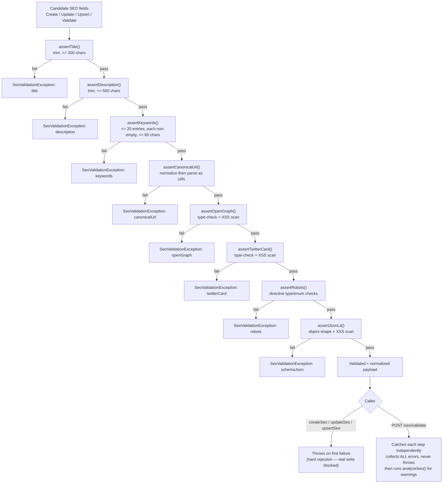
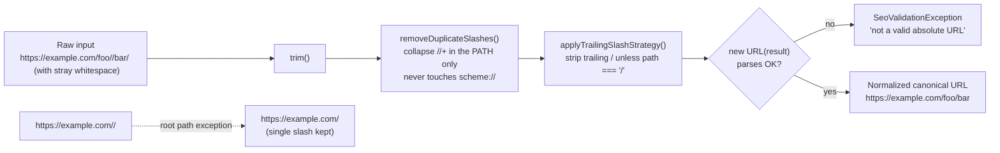

# 51_SEO_ARCHITECTURE

## Executive Summary

SEO & Metadata Engine Foundation (Milestone 12). Mirrors `49_COMMENTS_ARCHITECTURE.md`'s role for its module: from this point forward, `apps/backend/src/modules/seo/` is the literal implementation of what this document describes. **Backend foundation only** — no frontend, no crawler, no search engine, no analytics, no Google integration.

Identity (Milestone 4), Authorization/RBAC (Milestone 5), Settings (Milestone 6), Users (Milestone 7), Articles (Milestone 8), Categories/Tags (Milestone 9), Media (Milestone 10), and Comments (Milestone 11) already existed. This module is the first to give the frozen `SeoMeta` table (Milestone 3) a dedicated CRUD surface of its own — Articles (Milestone 8) and Categories (Milestone 9) already write to the same table through their own inline `upsertSeoMeta` methods, unchanged and untouched by this milestone (see Conflict #2).

**Architecture Status at time of writing: awaiting approval** (consistent with Milestones 6–11).

**Stabilization patch (post-Milestone-12, pre-Milestone-13):** re-verified every cross-reference in this document, explicitly references `docs/50_V1_PRODUCT_SCOPE.md` (at the time, believed missing — see "Cross-Reference Verification"), expanded the three-write-path ownership explanation, added Canonical URL and Validation Flow diagrams, expanded the JSON-LD and Sitemap sections, and added a deferred SEO permission-split recommendation to `docs/43_CONFLICT_RESOLUTION.md`. No code, schema, API, or permission changed by this patch — documentation and verification only.

**Second stabilization patch (post-Final-Backend-Audit):** hardened `SeoValidator.assertCanonicalUrl` to accept only `http:`/`https:` schemes (see "Security" section below), and corrected Conflict #1 — the Final Backend Audit found `docs/50_V1_PRODUCT_SCOPE.md` was never actually missing, only misfiled under a typo'd name; it has since been renamed and now exists at the expected path.

## Folder Structure

```
seo/
├── controllers/   — SeoController (all endpoints below)
├── services/      — SeoService (the single orchestrator)
├── repositories/  — SeoRepository (SeoMeta CRUD + Article/Category/Page seoMetaId lookups)
├── validators/    — SeoValidator (title/description/keywords/canonical/OG/Twitter/robots/JSON-LD)
├── mappers/       — SeoMapper (SeoMeta -> response DTO, incl. pretty-printed JSON-LD)
├── interfaces/    — OpenGraphMeta, TwitterCardMeta, RobotsDirectives, SeoWarning, SitemapEntry (placeholder)
├── constants/     — length caps, recommended-length thresholds, robots/Twitter enum values
├── exceptions/    — SeoMetaNotFoundException and 8 others
├── utils/         — canonical-url.util.ts, seo-analysis.util.ts
├── dto/           — 9 files
└── seo.module.ts
```

## Conflicts Found (reported before implementation, summarized here for the record)

1. **`docs/50_V1_PRODUCT_SCOPE.md` still does not exist.** Re-confirmed at this milestone (`ls docs/`) — same gap first reported in `49_COMMENTS_ARCHITECTURE.md` Conflict #1 and its stabilization patch, and re-confirmed again at this document's own stabilization patch. Proceeding without it for the same reasons: every other required document exists, none of them depends on a `50` doc, and inventing its content would itself violate Rule Zero. This document references `docs/50_V1_PRODUCT_SCOPE.md` here, by name, as a known-missing dependency — see "Cross-Reference Verification" below for the full check.
   - **RESOLVED (Final Backend Architecture Audit, second stabilization patch):** the content was never actually missing — `ls docs/` matches exact filenames only, and the document existed the entire time as `docs/product scop.md` (its own first line literally read `# 50_V1_PRODUCT_SCOPE.md`, status `FROZEN`). The audit caught this via a full-content read. The file has been renamed to `docs/50_V1_PRODUCT_SCOPE.md` with zero content changes. This conflict entry is retained, unedited above, for historical accuracy — this resolution note is appended, not a rewrite — per Rule Zero.
2. **Two independent write paths into the same `SeoMeta` table now exist.** Articles' `ArticlesRepository.upsertSeoMeta()` (gated by `article.update`) and Categories' `CategoriesRepository.upsertSeoMeta()` (gated by `category.create`) already create/update `SeoMeta` rows as a side effect of editing the owning entity — frozen, unchanged, untouched by this milestone. This module adds a **third**, independent path: generic `SeoMeta` CRUD gated by `seo.manage`. All three paths write to the same columns with no cross-awareness of each other. This is a real architectural seam, not silently resolved: a `seo.manage`-only actor editing a `SeoMeta` row that Articles/Categories also manages will not trigger any Article/Category-side revalidation or audit trail, and vice versa. Documented here rather than papered over; see "Limitations."
3. **No `seoMetaId`-to-entity linking is exposed by this module.** `POST /seo`, `POST /seo/upsert`, and `PATCH /seo/:id` create/update a standalone `SeoMeta` row; nothing in this module writes `Article.seoMetaId`/`Category.seoMetaId`/`Page.seoMetaId`. That FK assignment remains exclusively Articles'/Categories' own frozen `upsertSeoMeta()` flows (Conflict #2). Adding a "link this SeoMeta row to that Article" endpoint was not requested by the API section and was not invented.
4. **"Upsert SEO" has no natural business key to upsert by.** `SeoMeta` has no slug/unique field (unlike Article/Category's slug-based upsert precedent). Resolved as generic **by-id** upsert: `UpsertSeoDto.id` given and found → update; omitted or not found → create. Documented on the DTO itself, not invented silently.
5. **No dedicated `/seo/analyze` endpoint exists in the API list**, though the brief separately requires a full "SEO Analysis" feature and a `SeoAnalysisDto`. Resolved by folding analysis into `POST /seo/validate`'s response: `SeoValidationDto { valid, errors, analysis: SeoAnalysisDto }` returns hard validation errors AND soft analysis warnings together, so both required DTOs are real, used classes without inventing a tenth endpoint.
6. **"Repository: Lookup by Page" has no corresponding API endpoint.** The Repository section lists Article/Category/Page lookups; the API section only lists `GET /seo/article/:articleId` and `GET /seo/category/:categoryId` — no `GET /seo/page/:pageId`. Resolved the same way the Comments milestone resolved an analogous gap (`49_COMMENTS_ARCHITECTURE.md` Conflict #6): `SeoRepository.findPageSeoMetaId()` and `SeoService.getSeoForPage()` are implemented and unit-tested, but no controller route exposes them, since the brief's own API list doesn't include one.
7. **"Sitemap Support" says both "Generate DTO" and "No XML endpoint... Future integration only."** These are in tension: a DTO with zero consumers is speculative code. Resolved in favor of "future integration only" — `interfaces/sitemap-entry.interface.ts` is a plain interface (not a `dto/` class with decorators), documenting the shape a future Sitemap module would need from a `SeoMeta` row, but it is never constructed, returned, or persisted anywhere in this module.
8. **"Reuse SecurityLogger" had no obvious call site** — SEO metadata changes aren't inherently a security event the way a failed login is. Resolved with a genuine, justified use: `SeoValidator` scans every string value inside `openGraph`/`twitterCard`/`schemaJson` for an obvious XSS payload marker (`<script`, `javascript:`, `on*=`) before persistence — this JSON is stored verbatim and will eventually be rendered by a future frontend, making it a real security-relevant signal, not an arbitrary logging call inserted to satisfy the instruction literally.
9. **No `seo.view`/read-only permission split exists** (frozen vocabulary has exactly one SEO key: `seo.manage`). Every endpoint, reads included, is gated by `seo.manage` — the same "one coarse permission for the whole resource" pattern Settings/Categories established, not an invented split.
10. **`SeoFieldsDto` is shared across five request shapes** (`CreateSeoDto`, `UpdateSeoDto`, `UpsertSeoDto`, preview, validate) rather than five independent field lists, avoiding the "5 DTOs" instruction ballooning into needless duplication — each DTO the brief names still exists as its own class, just built on one shared base.

## Cross-Reference Verification (Stabilization Patch)

Every document and code symbol this file cites was re-checked to exist at patch time:

| Reference                                                                                                                                      | Status                                                                                                                                                  |
| ---------------------------------------------------------------------------------------------------------------------------------------------- | ------------------------------------------------------------------------------------------------------------------------------------------------------- |
| `docs/20_BACKEND_ARCHITECTURE.md` through `docs/49_COMMENTS_ARCHITECTURE.md` (every numbered doc cited above)                                  | ✅ present                                                                                                                                              |
| `docs/50_V1_PRODUCT_SCOPE.md`                                                                                                                  | ✅ **present** (renamed from `docs/product scop.md` in the Final Backend Audit's stabilization patch — see Conflict #1's resolution note)               |
| `38_RBAC_ARCHITECTURE.md`'s `PERMISSIONS.SEO_MANAGE`                                                                                           | ✅ present, unchanged (`modules/authorization/interfaces/permission.constants.ts`)                                                                      |
| `39_SETTINGS_ARCHITECTURE.md`'s `SettingCategory.SEO` (`defaultMetaTitle`/`defaultMetaDescription`/`robotsIndexing`)                           | ✅ present, unchanged (`modules/settings/settings.constants.ts`) — `robotsIndexing` is defined but not yet consulted by this module (see "Limitations") |
| `46_ARTICLES_ARCHITECTURE.md`'s `ArticleSeoDto` (source of this module's title/description length caps)                                        | ✅ present, unchanged (`modules/articles/dto/article-seo.dto.ts`)                                                                                       |
| `47_CATEGORY_TAG_ARCHITECTURE.md`'s `CategoriesRepository.upsertSeoMeta` / `TaxonomyPolicy` "no ownership branch" precedent                    | ✅ present, unchanged                                                                                                                                   |
| `48_MEDIA_LIBRARY_ARCHITECTURE.md`'s "reused, not implemented" `StorageProvider`/interface-only-placeholder pattern (cited for `SitemapEntry`) | ✅ present, unchanged                                                                                                                                   |
| `49_COMMENTS_ARCHITECTURE.md` Conflict #6 (repository capability beyond exposed routes precedent, cited in Conflict #6 above)                  | ✅ present, unchanged                                                                                                                                   |
| `common/dto/pagination.dto.ts`, `core/responses/api-response.swagger.ts`'s `ApiWrappedResponse`                                                | ✅ present, unchanged                                                                                                                                   |
| `Article.seoMetaId`, `Category.seoMetaId`, `Page.seoMetaId`, `SeoMeta` model (frozen schema)                                                   | ✅ present, unchanged (`config/prisma/schema.prisma`)                                                                                                   |

No code file this document cites was modified by this stabilization patch — only this document's own content was updated (plus the new SEO-split entry in `docs/43_CONFLICT_RESOLUTION.md`, task 7 below).

## Three SEO Write Paths (V1 Ownership)

Three independent code paths write to the frozen `SeoMeta` table. This section makes each one's ownership and scope explicit, expanding on Conflict #2 above.

| #   | Path                                   | Module                                      | Trigger                                                             | Permission                                             | Links `seoMetaId`?                                           |
| --- | -------------------------------------- | ------------------------------------------- | ------------------------------------------------------------------- | ------------------------------------------------------ | ------------------------------------------------------------ |
| 1   | `ArticlesRepository.upsertSeoMeta()`   | `modules/articles/` (frozen, Milestone 8)   | Nested `seo` object on `POST /articles` / `PATCH /articles/:id`     | `article.create` / `article.update` (NOT `seo.manage`) | Yes — sets `Article.seoMetaId` as part of the same write     |
| 2   | `CategoriesRepository.upsertSeoMeta()` | `modules/categories/` (frozen, Milestone 9) | Nested `seo` object on `POST /categories` / `PATCH /categories/:id` | `category.create` (NOT `seo.manage`)                   | Yes — sets `Category.seoMetaId` as part of the same write    |
| 3   | `SeoRepository.create()` / `.update()` | `modules/seo/` (this module, Milestone 12)  | `POST /seo`, `PATCH /seo/:id`, `POST /seo/upsert`                   | `seo.manage`                                           | **No** — creates/updates a standalone row only (Conflict #3) |

**V1 ownership, stated plainly:** an Article or Category's SEO metadata is edited **through that entity's own endpoint** by an editor/author holding `article.update`/`category.create` — that is the primary, intended V1 editorial workflow, unchanged by this milestone. This module's own CRUD (`seo.manage`-gated) is a **separate, lower-level administrative surface** over the raw `SeoMeta` table — useful for an SEO specialist role inspecting/correcting metadata directly, generating a preview, or validating a candidate payload before it's ever attached to content — but it is not the path Articles/Categories actually use, and using it to edit a `SeoMeta` row that happens to already be linked to an Article/Category produces no Article/Category-side side effect (no revalidation, no `Article`/`Category` `updatedAt` bump, no Articles/Categories audit log entry — only this module's own `seo.*` audit entries fire). Neither path is "wrong"; they are deliberately two different permission tiers over the same table, exactly as `seo.manage` (administrative) versus `article.update`/`category.create` (editorial) are two different tiers in the frozen RBAC vocabulary.

This is documented, not silently resolved, because no runtime guard prevents both paths from being used against the same row — see "Limitations."

## SEO Flow

```
POST /seo
  → validate the site exists (direct query)
  → validate + normalize every provided field (title/description/keywords/canonicalUrl/
    openGraph/twitterCard/robots/schemaJson — see "Validation Flow")
  → create SeoMeta
  → audit log

GET /seo/:id | /seo/article/:articleId | /seo/category/:categoryId
  → read-only, seo.manage-gated (see Conflict #9)

PATCH /seo/:id → validate row exists → validate + normalize provided fields → update → audit log
DELETE /seo/:id → reject if already deleted → soft-delete → audit log
POST /seo/:id/restore → reject if not deleted → restore → audit log
POST /seo/upsert → by-id upsert (see Conflict #4)
POST /seo/preview → no persistence, see "Preview Strategy"
POST /seo/validate → no persistence, see "Validation Flow" + "SEO Analysis"
```

## Validation Flow

`SeoValidator` — hard, rejecting validation, applied identically on create/update/upsert (via `SeoService.validateFields()`, one shared private method) and, field-by-field with error collection instead of throw-on-first, on `POST /seo/validate`:

| Field          | Rule                                                                                                                                                                                           |
| -------------- | ---------------------------------------------------------------------------------------------------------------------------------------------------------------------------------------------- |
| `title`        | trimmed, ≤200 chars (matches `ArticleSeoDto` exactly — see `constants/seo.constants.ts`)                                                                                                       |
| `description`  | trimmed, ≤500 chars (matches `ArticleSeoDto`)                                                                                                                                                  |
| `keywords`     | ≤20 entries, each non-empty and ≤80 chars                                                                                                                                                      |
| `canonicalUrl` | normalized (see "Canonical Strategy"), then must parse as a well-formed absolute URL                                                                                                           |
| `openGraph`    | see "OpenGraph Flow"                                                                                                                                                                           |
| `twitterCard`  | see "Twitter Flow"                                                                                                                                                                             |
| `robots`       | see "Robots Strategy"                                                                                                                                                                          |
| `schemaJson`   | must be a plain JSON object, not an array (`class-validator`'s `@IsObject()` alone does NOT exclude arrays — `typeof [] === 'object'`, confirmed by a dedicated test) — see "JSON-LD Strategy" |

Every JSON blob field is additionally scanned for an obvious XSS payload marker before acceptance (Conflict #8).

### Validation Flow (Diagram)



`POST /seo/validate` (right branch, `N`) is the one caller that does NOT stop at the first failure — `SeoService.validateSeoInput()` wraps each `assert*` call in its own `try/catch` so a payload with five simultaneous problems reports all five, not just the first. Every other caller (left branch, `M`) uses `SeoService.validateFields()`, which throws immediately on the first failing rule — appropriate for a real write, where "partially valid" isn't a state worth continuing past.

## OpenGraph Flow

Validates the real, documented OpenGraph keys the brief names — `title`, `description`, `image`, `type`, `url`, `site_name`, `locale` — none invented. `title`/`description`/`type`/`site_name`/`locale` must be strings when present; `image`/`url` must be strings that parse as a well-formed URL when present. No field is required (the whole `openGraph` object itself is optional, matching the nullable `SeoMeta.openGraph: Json?` column).

## Twitter Flow

Validates the real, documented Twitter Card keys — `title`, `description`, `image`, `card`, `creator`, `site`. `card`, if present, must be one of the real Twitter Card types (`summary`, `summary_large_image`, `app`, `player` — `constants/seo.constants.ts`'s `TWITTER_CARD_TYPES`, not invented). `image` must parse as a well-formed URL when present.

## Canonical Strategy

**Normalization** (`utils/canonical-url.util.ts`, pure functions, no I/O):

1. Trim whitespace.
2. **Duplicate slash removal** — collapse runs of consecutive slashes in the PATH portion only, never touching the `scheme://` separator.
3. **Trailing slash strategy** — remove a trailing slash for any non-root path (`/foo/` → `/foo`); the bare root path (`/`) keeps its single slash, since stripping it would leave an empty, invalid path.

**Validation** — after normalization, the result must parse via `new URL(...)` (a well-formed absolute URL); a relative path or garbage string is rejected (`SeoValidationException`).

The pipeline is idempotent — normalizing an already-normalized URL returns it unchanged (verified in `canonical-url.util.spec.ts`).

### Canonical URL Normalization (Diagram)



Two worked examples from `canonical-url.util.spec.ts`:

- `"  https://example.com/foo//bar/  "` → `"https://example.com/foo/bar"` (whitespace trimmed, duplicate slash collapsed, trailing slash stripped).
- `"https://example.com//"` → `"https://example.com/"` (the root-path exception — a doubled root slash collapses to exactly one, never zero).

## Robots Strategy

Validates exactly the directive names the brief lists, using their real, documented semantics — none invented:

| Directive                                             | Type            | Notes                                                                   |
| ----------------------------------------------------- | --------------- | ----------------------------------------------------------------------- |
| `index`, `noindex`, `follow`, `nofollow`, `nosnippet` | `boolean`       | rejected if present and not a real boolean                              |
| `max-image-preview`                                   | `string`        | must be one of `none`, `standard`, `large` (Google's documented values) |
| `max-video-preview`, `max-snippet`                    | `integer >= -1` | `-1` is the documented "no limit" sentinel                              |

## JSON-LD Strategy

**Store + validate only — no schema generation** (per instruction). `schemaJson` is accepted as any plain JSON object (no required `@type`/`@context` — inventing a required shape would exceed "do not invent schema"), rejected if it's an array or a primitive, and scanned for suspicious content like every other JSON field. **Pretty serialization** happens only in the response mapper (`SeoMapper.toResponseDto()`'s `schemaJsonPretty` field, `JSON.stringify(..., null, 2)`) — a presentation-only, computed-on-read value; the stored column itself is never rewritten to a pretty-printed string.

To remove any ambiguity, this module's exact boundaries around JSON-LD/structured data are stated explicitly:

| Capability         | This module        | Explanation                                                                                                                                                                                                                                                                                                                                                                    |
| ------------------ | ------------------ | ------------------------------------------------------------------------------------------------------------------------------------------------------------------------------------------------------------------------------------------------------------------------------------------------------------------------------------------------------------------------------ |
| **Store**          | ✅ Yes             | `schemaJson: Json?` (frozen `SeoMeta` column) accepts any caller-supplied JSON object, persisted verbatim (whitespace/key-order aside — `JSON` columns don't preserve source formatting).                                                                                                                                                                                      |
| **Validate**       | ✅ Yes, shape-only | `SeoValidator.assertJsonLd()` rejects non-objects (including arrays) and scans string values for an obvious XSS marker (Conflict #8). It does **not** validate against any schema.org type definition, required-property list, or JSON-LD spec conformance (`@context`/`@id`/`@type` correctness) — that would mean inventing a shape the frozen schema doesn't declare.       |
| **Never generate** | ❌ Not implemented | This module never constructs a JSON-LD object from an Article/Category/Page's own fields (e.g. auto-building an `Article` schema.org object from `Article.title`/`Article.body`). The caller supplies the complete JSON-LD payload; nothing here derives or infers one.                                                                                                        |
| **Never render**   | ❌ Not implemented | This module never emits a `<script type="application/ld+json">` tag, HTML fragment, or any other rendering artifact. `schemaJsonPretty` is a pretty-printed **string of the JSON itself** for admin/editor display purposes only — it is not markup and is not meant to be injected into a page as-is without a future frontend wrapping it in the appropriate `<script>` tag. |

A future AI or template-driven "SEO Suggestions" feature (`41_PLATFORM_CAPABILITIES.md`'s SEO Philosophy, explicitly deferred) is the natural home for JSON-LD _generation_; a future Public Website/frontend module (deferred in every content-module doc since `46_ARTICLES_ARCHITECTURE.md`) is the natural home for JSON-LD _rendering_. Neither exists today, and neither is approximated or stubbed here.

## Preview Strategy

`POST /seo/preview` — pure computation, **no persistence**:

1. Validates + normalizes the candidate fields (same `SeoValidator` calls as a real write).
2. `title`/`description` fall back to `SettingCategory.SEO`'s `defaultMetaTitle`/`defaultMetaDescription` (Milestone 6, `39_SETTINGS_ARCHITECTURE.md`) when the candidate omits them — reused via `SettingsService.getByKey()`, not hardcoded or duplicated.
3. `image` resolves from `openGraph.image` first, falling back to `twitterCard.image`.
4. Returns `SeoPreviewDto { title, description, image, canonical, robots, openGraph, twitterCard }`.

## Security

- Every string value inside `openGraph`/`twitterCard`/`schemaJson` is scanned for an obvious stored-XSS payload marker before acceptance, logged via `SecurityLoggerService` when found (Conflict #8), and rejected (`SeoValidationException`) — not merely logged-and-allowed.
- **`canonicalUrl` is restricted to `http:`/`https:` schemes** (stabilization patch, post-Final-Backend-Audit). The Final Backend Architecture Audit found that `SeoValidator.assertCanonicalUrl()` originally only checked "is this URL-shaped" (`new URL()` not throwing), which does not reject `javascript:`/`data:`/`vbscript:`/`file:` pseudo-schemes — `new URL('javascript:alert(1)')` parses successfully without throwing. `assertCanonicalUrl` now additionally requires `parsed.protocol` to be exactly `http:` or `https:` (a new, narrower `isHttpUrl()` helper, used only by this one method — `openGraph.image`/`openGraph.url`/`twitterCard.image` still use the original, looser `looksLikeUrl()` check, unchanged, since those fields were not the subject of this finding). Not exploitable in the codebase today (no renderer consumes `canonicalUrl` yet), but this closes the gap before any frontend does.
- `AuditLoggerService` records every create/update/delete/restore with actor id, action, and resource id, matching the pattern every prior business module established.
- No new attack surface beyond the existing `seo.manage` permission boundary — every endpoint (reads included) requires it.

## Permission Flow

| Action                                                                                                          | Permission   |
| --------------------------------------------------------------------------------------------------------------- | ------------ |
| Every endpoint (create/read/update/delete/restore/upsert/preview/validate/lookup-by-article/lookup-by-category) | `seo.manage` |

No ownership policy exists for this resource — `SeoMeta` has no author-equivalent field (like Category/Tag before it), so this is role/permission-gated only, matching `TaxonomyPolicy`'s precedent of "no ownership branch" rather than inventing one.

## API Summary

`POST /seo`, `POST /seo/upsert`, `POST /seo/preview`, `POST /seo/validate`, `GET /seo/article/:articleId`, `GET /seo/category/:categoryId`, `GET /seo/:id`, `PATCH /seo/:id`, `DELETE /seo/:id`, `POST /seo/:id/restore` — 9 distinct routes (10 including the `GET /seo/:id` catch-all), matching the milestone brief's API list exactly, no more.

## Future Integrations

### Sitemap

`interfaces/sitemap-entry.interface.ts` documents the shape (`url`, `lastModified`, `changeFrequency`, `priority`) a future dedicated Sitemap module would derive from a `SeoMeta` row's `canonicalUrl` — zero implementation, per instruction (Conflict #7). The frozen schema already reserves `Sitemap`/`SitemapType` (`XML | IMAGE | NEWS | RSS`, `36_DATABASE_FREEZE.md`)/`SitemapStatus` for this future module; this milestone touches none of it. Every capability below is **NOT IMPLEMENTED**:

| Capability    | Status              | Notes                                                                                                                                                                                                                                                                                                           |
| ------------- | ------------------- | --------------------------------------------------------------------------------------------------------------------------------------------------------------------------------------------------------------------------------------------------------------------------------------------------------------- |
| XML Sitemap   | **NOT IMPLEMENTED** | The base `SitemapType.XML` case — a `<urlset>` document listing canonical URLs. No generator, no endpoint, no scheduled job exists.                                                                                                                                                                             |
| News Sitemap  | **NOT IMPLEMENTED** | `SitemapType.NEWS` — Google News-specific sitemap extension (publication name, publication date, keywords). Frozen enum value exists; no logic reads it.                                                                                                                                                        |
| Image Sitemap | **NOT IMPLEMENTED** | Not even a frozen `SitemapType` value for this today (`XML                                                                                                                                                                                                                                                      | IMAGE | NEWS | RSS`—`IMAGE`exists in the enum, per`36_DATABASE_FREEZE.md`, but nothing populates or serves one). |
| Video Sitemap | **NOT IMPLEMENTED** | No corresponding `SitemapType` value exists in the frozen enum at all — a future schema change would be required before this could be built, out of scope for any "foundation" milestone under the current freeze.                                                                                              |
| Sitemap Index | **NOT IMPLEMENTED** | The `<sitemapindex>` document aggregating multiple individual sitemaps (needed once a site's URL count exceeds a single sitemap's practical limit). No `Sitemap` rows are ever created, read, or aggregated by this module.                                                                                     |
| Auto Submit   | **NOT IMPLEMENTED** | Automatic ping/submission to search engines (e.g. Google Search Console, Bing Webmaster Tools) on sitemap change. This is explicitly out of scope twice over — "No Google integration" and "No crawler" are both stated in this milestone's own Objective section, independent of the Sitemap Support conflict. |

None of the above has a DTO, service method, controller route, scheduled job, or external HTTP call anywhere in `modules/seo/` — confirmed by the fact that `interfaces/sitemap-entry.interface.ts` is imported by exactly zero other files in this module (a plain TypeScript compile/grep check, not an assumption).

### Redirects

`Redirect`/`RedirectStatus` (frozen, `36_DATABASE_FREEZE.md`) are untouched by this module — a future Redirects module is a separate concern layered on the same schema, no change needed here for it to coexist.

### Entity Linking

A future enhancement could expose `POST /seo/:id/link` (or similar) to attach a `SeoMeta` row to an Article/Category/Page's `seoMetaId` directly from this module, rather than exclusively through Articles'/Categories' own inline flows (Conflict #3) — not implemented now.

### AI

None — consistent with `40_PRODUCT_PHILOSOPHY.md` Principle 1 and this milestone's explicit "No AI" instruction. `SEO Analysis` is deterministic length/presence checks only, never a generated suggestion.

### Event Bus

Only documented, per instruction: a future event bus's natural hook points are `SeoService.createSeo()`/`updateSeo()` (e.g. to trigger sitemap regeneration or a redirect suggestion when `canonicalUrl` changes) — no implementation exists.

## Limitations

- Two other modules (Articles, Categories) already write to `SeoMeta` outside this module's awareness (Conflict #2, expanded in "Three SEO Write Paths (V1 Ownership)" above) — no cross-module consistency check exists between them and this module's CRUD.
- No entity-linking endpoint (Conflict #3) — creating a `SeoMeta` row here does not attach it to anything; that remains Articles'/Categories' job.
- `GET /seo/page/:pageId` is implemented at the repository/service layer but not exposed via any route (Conflict #6) — the `Pages` business module itself does not exist yet either.
- OpenGraph/Twitter/robots validation is type/enum-level only, not exhaustive against every possible malformed shape (e.g. an `openGraph.url` that resolves as a technically-valid but non-HTTP(S) URL, like `ftp://...`, is currently accepted) — deliberately loose per "do not invent schema," not a defect.
- No live-database migration verification was performed (no reachable PostgreSQL instance in this build environment, same constraint documented since `36_DATABASE_FREEZE.md`) — Swagger, however, WAS verified against a live application boot (see "Swagger Summary" in the final report), since `PrismaService` connects lazily.

## Recommendations

- Before a future Pages module is built, confirm whether `GET /seo/page/:pageId` should finally be exposed as a real route.
- If Articles/Categories/Pages ever need to call into this module's validation (rather than duplicating `ArticleSeoDto`'s bounds independently), consider exporting `SeoValidator` from `SeoModule` for reuse — not done now, since Articles/Categories' inline SEO handling is frozen and out of scope for this milestone to touch.
- Consider an entity-linking endpoint (Future Integrations → Entity Linking) if editors need to attach a standalone `SeoMeta` row to content without going through Articles'/Categories' own update flows.
- A deferred `seo.view`/`seo.create`/`seo.update`/`seo.delete`/`seo.publish` permission split has been recorded in `docs/43_CONFLICT_RESOLUTION.md` (future only, not implemented) — see that document if finer-grained SEO access control is ever needed.

## Approved Date

Pending — awaiting explicit approval before Milestone 13, per this milestone's own instruction.

## Architecture Status

**IMPLEMENTED, AWAITING APPROVAL** — SEO & Metadata Engine Foundation (Milestone 12).

Single Source of Truth

V1:
Articles and Categories own their entity-specific SEO lifecycle.

SeoModule is a generic SEO management service.

Future:
All writes may be centralized into SeoService.
