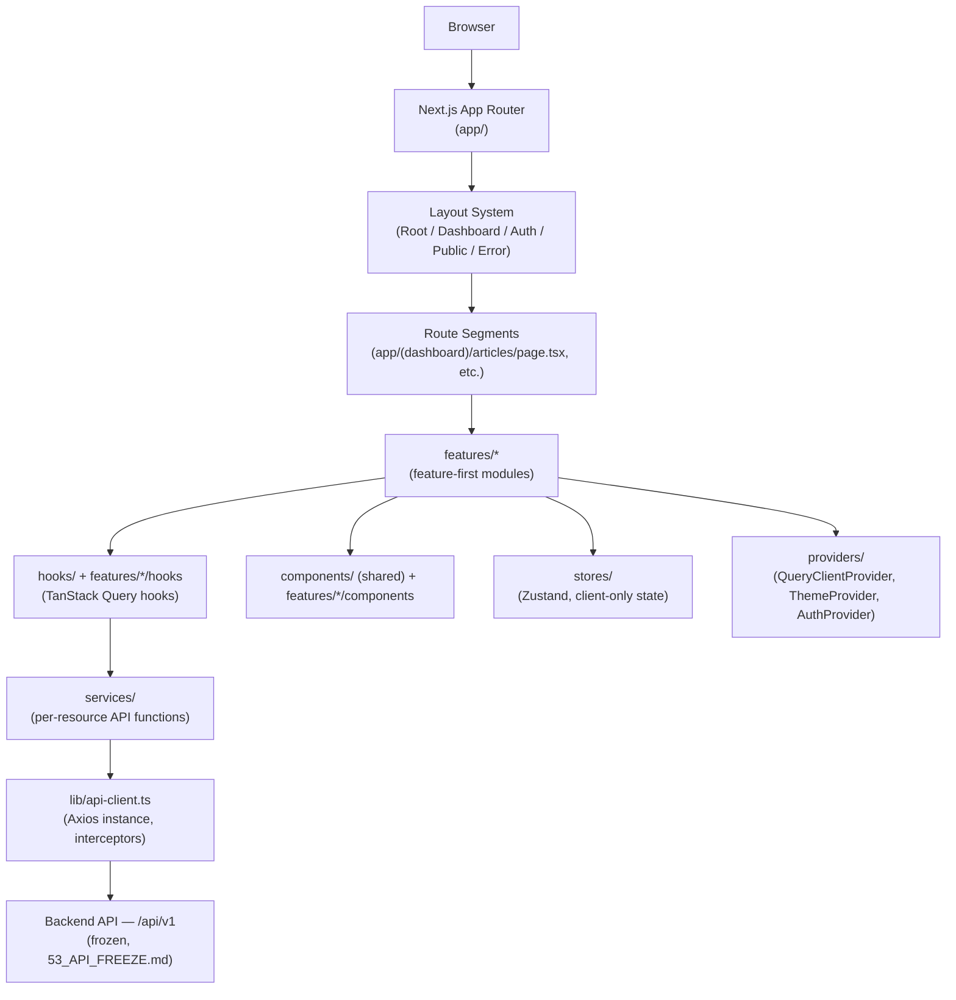

# 56_ADMIN_FRONTEND_ARCHITECTURE

## Purpose

Defines the architecture for `apps/admin` — the Next.js administration panel consuming the frozen V1 backend API (`53_API_FREEZE.md`). **Architecture only — no implementation.** This document is the frontend counterpart to `35_ARCHITECTURE_FREEZE.md`: from the point this is approved, `apps/admin/` must be built to match what's described here, and any deviation discovered during implementation must be reported as a conflict (per `RULE_ZERO`), not silently resolved.

The backend is frozen (`52_BACKEND_FREEZE_REPORT.md`). This document adapts the frontend to the backend's existing contract — it does not request, imply, or assume any backend change, new endpoint, or new permission.

## Architecture

### Guiding Principles

1. **Feature-first, not type-first at the top level.** Code is organized by business capability (`articles`, `media`, `comments`, `seo`, `users`, `settings`) mirroring the backend's own module boundaries (`44_SYSTEM_OVERVIEW.md`), not by technical layer (`components/`, `hooks/` as flat global buckets). This keeps each feature's UI, hooks, API bindings, and types colocated and lets the admin panel grow one backend module at a time, matching how the backend itself shipped one module per milestone.
2. **The backend is the only source of truth for authorization.** Every RBAC decision described below (route guards, component guards, menu visibility) is a UX convenience that mirrors what the backend will independently re-enforce — never a substitute for it. `55_FRONTEND_HANDOFF.md`'s warning applies verbatim: "never rely on client-side permission checks as actual security."
3. **Server state and client state are architecturally separate.** TanStack Query owns everything that originates from the API (articles, users, settings, ...). Zustand owns only genuinely client-only state that has no server representation (sidebar collapsed/expanded, active theme before hydration, a multi-step wizard's in-progress draft). If a piece of state can be derived from a TanStack Query cache, it is never duplicated into a Zustand store.
4. **One API client, one contract.** A single Axios instance and a single generated/hand-typed contract layer talks to the backend's frozen envelope (`53_API_FREEZE.md`). No feature module constructs its own `fetch` call or reimplements pagination/error handling.
5. **Composition over configuration.** Shared primitives (DataTable, Form, Dialog) are composed per-feature via typed props/render functions, not driven by giant configuration objects that become unreadable as features accumulate.

### High-Level Diagram



### Runtime Data Flow (one request, end to end)

```
Page component (Server or Client Component)
  → feature hook (e.g. useArticles(filters)) — TanStack Query
    → service function (e.g. articlesService.list(filters)) — typed, one per resource
      → apiClient.get('/articles', { params }) — Axios instance
        → Request Interceptor: attach Authorization: Bearer <accessToken>
        → Backend
        ← Response Interceptor: unwrap { success, data, meta, errors } envelope
        ← on 401: attempt one refresh + retry (see "Authentication")
    ← TanStack Query cache updated, component re-renders
```

## Folder Structure

Full detail and rationale for every directory lives in `58_FRONTEND_FOLDER_STRUCTURE.md` — summarized here for architectural context only:

```
apps/admin/src/
├── app/            — Next.js App Router route segments + layouts only (thin — no business logic)
├── features/       — one directory per backend-module-aligned feature (articles, categories, tags,
│                     media, comments, seo, users, settings, dashboard, auth)
├── components/     — shared, feature-agnostic UI (design-system primitives + composed shared widgets)
├── hooks/          — shared, feature-agnostic hooks (useDebounce, useMediaQuery, etc.)
├── lib/            — API client, query client, utility singletons
├── providers/      — top-level React context providers
├── services/       — cross-feature service utilities (not resource-specific — those live in features/*/services)
├── stores/         — global Zustand stores (UI-shell state only — sidebar, theme-before-hydration)
├── styles/         — Tailwind config layer, global CSS, design tokens
├── types/          — shared cross-feature TypeScript types (API envelope, pagination, permission strings)
└── utils/          — pure, framework-agnostic helper functions
```

## App Router — Route Structure

Every route group below maps to a backend module already frozen in `53_API_FREEZE.md`. No route exists for a backend capability that isn't implemented (Search, Ads, Analytics, Notifications, Scheduler, AI are NOT scaffolded — they're future work per `54_RELEASE_NOTES_V1.md`'s Deferred Features, and adding an empty shell page for them now would be implementation, out of scope for this architecture-only milestone).

```
app/
├── (auth)/                          — Authentication Layout
│   ├── login/page.tsx
│   ├── forgot-password/page.tsx
│   └── reset-password/page.tsx
├── (dashboard)/                     — Dashboard Layout (authenticated shell)
│   ├── dashboard/page.tsx           — landing/overview (DASHBOARD_VIEW)
│   ├── articles/
│   │   ├── page.tsx                 — list (article.create|update|delete|publish, per backend's RequireAnyPermission)
│   │   ├── new/page.tsx             — create (article.create)
│   │   ├── [id]/page.tsx            — edit (article.update, ownership-gated by backend)
│   │   └── [id]/revisions/page.tsx  — revision history
│   ├── categories/
│   │   ├── page.tsx                 — tree/list (category.create, reused per backend)
│   │   ├── new/page.tsx
│   │   └── [id]/page.tsx
│   ├── tags/
│   │   ├── page.tsx                 — (category.create, reused per backend)
│   │   └── [id]/page.tsx
│   ├── media/
│   │   ├── page.tsx                 — library (media.upload|delete)
│   │   └── folders/[id]/page.tsx
│   ├── comments/
│   │   └── page.tsx                 — moderation queue (comment.moderate) + own-comment views
│   ├── seo/
│   │   └── page.tsx                 — standalone SeoMeta admin surface (seo.manage) — NOT the per-article SEO form, which lives inline in articles/[id]
│   ├── users/
│   │   ├── page.tsx                 — (users.manage)
│   │   ├── new/page.tsx
│   │   └── [id]/page.tsx
│   ├── roles/
│   │   └── page.tsx                 — READ-ONLY view of role→permission assignments (roles.manage permission exists; no Roles CRUD backend endpoint exists yet per `54_RELEASE_NOTES_V1.md` — this route renders `GET /authorization/me`-style data only until a Roles module ships; see "Limitations")
│   ├── settings/
│   │   └── [category]/page.tsx      — one page per SettingCategory (settings.manage)
│   ├── profile/
│   │   ├── page.tsx                 — self-service (no permission, JwtAuthGuard only)
│   │   └── sessions/page.tsx        — admin-only per `55_FRONTEND_HANDOFF.md` (no /users/me/sessions exists)
│   ├── activity-logs/
│   │   └── page.tsx                 — PLACEHOLDER route reserved for the future durable Audit module (`54_RELEASE_NOTES_V1.md` Deferred Features) — renders an explicit "not yet available" empty state, never fake data
│   └── system/
│       └── page.tsx                 — health/build-info surface (`GET /health`), read-only
├── (public)/                        — Public Layout (reserved; V1 admin has no public-facing route)
├── error.tsx, not-found.tsx, global-error.tsx  — Error Layout
└── layout.tsx                       — Root Layout
```

## Layout System

| Layout                    | Wraps                                                | Responsibility                                                                                                                                     |
| ------------------------- | ---------------------------------------------------- | -------------------------------------------------------------------------------------------------------------------------------------------------- |
| **Root Layout**           | Everything                                           | `<html>`/`<body>`, font loading, `ThemeProvider`, `QueryClientProvider`, global toast host — no auth/permission logic                              |
| **Dashboard Layout**      | `(dashboard)/*`                                      | Sidebar navigation (`60_ADMIN_NAVIGATION.md`), topbar, auth guard (redirect to `/login` if unauthenticated), permission-aware menu rendering       |
| **Authentication Layout** | `(auth)/*`                                           | Centered card shell, redirect-if-already-authenticated guard, no sidebar                                                                           |
| **Public Layout**         | `(public)/*`                                         | Reserved for a future public-facing surface; V1 admin panel has no public route, kept as an architectural placeholder only                         |
| **Error Layout**          | `error.tsx`/`not-found.tsx`/`global-error.tsx`       | Consistent error-state chrome (see "Empty/Error States" in `57_DESIGN_SYSTEM.md`), maps backend `errors[].code` to a human message where available |
| **Modal Layout**          | Next.js parallel/intercepting route slot (`@modal`)  | Route-addressable dialogs (e.g. `/media?preview=<id>` opens a preview dialog without leaving the library grid)                                     |
| **Drawer Layout**         | Same parallel-route pattern as Modal, right-anchored | Side-panel detail views (e.g. comment thread inspector) that shouldn't consume the full page                                                       |

## State Management

| Concern                              | Tool                                                       | Rule                                                                                                                                                                                                                                                    |
| ------------------------------------ | ---------------------------------------------------------- | ------------------------------------------------------------------------------------------------------------------------------------------------------------------------------------------------------------------------------------------------------- |
| Server state (anything from the API) | TanStack Query                                             | One query-key factory per feature (`articles.keys.list(filters)`, `articles.keys.detail(id)`); mutations invalidate the narrowest correct key set, never a blanket refetch-everything                                                                   |
| Client-only UI state                 | Zustand                                                    | Only for state with no server representation and no legitimate URL representation either (see below); kept in small, feature-scoped stores, not one giant global store                                                                                  |
| Shareable/bookmarkable UI state      | URL search params (`useSearchParams`/`nuqs`-style pattern) | Table page/sort/filter state belongs in the URL, not Zustand — this makes a filtered/sorted table view linkable and keeps back/forward navigation correct, and is standard for a DataTable-heavy admin panel                                            |
| Form state                           | React Hook Form                                            | Uncontrolled-by-default for performance; one Zod schema per form, colocated with the form component                                                                                                                                                     |
| Validation                           | Zod                                                        | Every form schema mirrors (never exceeds) the corresponding backend DTO's `class-validator` rules — e.g. the article title's `@MaxLength(200)` becomes `z.string().max(200)`; frontend validation is a UX head-start, the backend remains authoritative |

## API Layer

### Axios Client (`lib/api-client.ts`)

- One `axios.create({ baseURL: '/api/v1' })` instance, imported everywhere via `services/*`, never instantiated ad hoc.
- **Request Interceptor**: attaches `Authorization: Bearer <accessToken>` from the auth store; attaches nothing on the 6 `@Public()` auth endpoints (`53_API_FREEZE.md` §Authentication).
- **Response Interceptor**: unwraps `{ success, data, meta, errors }` — a resolved promise carries `data`+`meta` directly to the caller (React components never touch the raw envelope); a `success: false` response rejects with a typed `ApiError` carrying `errors[]` and `meta.requestId`.
- **Token Refresh**: on a `401` from any non-auth endpoint, the interceptor queues concurrent requests, attempts exactly one `POST /auth/refresh`, replays the queue with the new access token on success, or clears the session and redirects to `/login` on failure — implementing `55_FRONTEND_HANDOFF.md`'s "refresh-on-401-retry-once" pattern as shared infrastructure, not per-feature code.
- **Error Handling**: `ApiError` exposes `.code` (from `errors[0].code`, the stable machine-readable value per `53_API_FREEZE.md`) for programmatic branching, and `.message` for display — mirroring `55_FRONTEND_HANDOFF.md`'s "map code, not message" guidance.
- **Pagination/Filtering/Sorting/Search**: every list-service function accepts one typed `{ page, limit, sortBy, sortOrder, ...filters }` object per resource (matching that resource's backend `*QueryDto` exactly — no invented filter the backend doesn't support) and returns `{ items, pagination }`, matching `meta.pagination`'s shape 1:1.
- **Upload**: architecture reserved only (see "Media Strategy") — no upload call exists today because the backend has no file-receiving endpoint (`55_FRONTEND_HANDOFF.md`: Media is metadata-registration only).
- **Retry Strategy**: TanStack Query's built-in retry (exponential backoff, 3 attempts, network/5xx errors only — never retries a 4xx, since those are correctness errors, not transient ones) is the sole retry mechanism; Axios-level retry is deliberately not layered on top, to avoid double-retry ambiguity.

## Authentication

Implements `55_FRONTEND_HANDOFF.md`'s Authentication/Refresh Flow exactly — no reinterpretation:

- `POST /auth/login` → store `accessToken`/`refreshToken` → redirect to `/dashboard`.
- Access token attached to every request via the interceptor above.
- `401` → one silent refresh-and-retry; refresh failure → clear session, redirect to `/login?redirect=<original path>`.
- **419 ("session expired") is not a real backend status** — the backend returns `401` for both "no token" and "expired token"; the frontend's own auth layer is responsible for distinguishing "never logged in" (redirect silently) from "was logged in, now expired" (show a toast: "Your session expired, please log in again") using local state (was a token previously present), not a backend signal.
- `403` → never redirect; render an in-place "you don't have permission" state (see "Empty/Error States", `57_DESIGN_SYSTEM.md`) since the user IS authenticated, just not authorized for this specific action.
- Token storage: architecture defers the exact mechanism (httpOnly-cookie proxy vs. in-memory-plus-refresh-on-load) to implementation time, per `55_FRONTEND_HANDOFF.md`'s explicit caveat that this is a security decision for the implementing team, not one this architecture document should lock in prematurely.

## Permission Flow (Frontend RBAC Layer)

Fetches `GET /authorization/me` once after login (`{ roles, permissions }`), cached in TanStack Query (long `staleTime`, manually invalidated on any user/role-affecting mutation) and exposed via a `usePermissions()` hook. Four guard levels, all reading from that one cached source:

| Guard                   | Applies to                                                                             | Behavior when denied                                                                                                                          |
| ----------------------- | -------------------------------------------------------------------------------------- | --------------------------------------------------------------------------------------------------------------------------------------------- |
| **Route Guard**         | Layout-level, per route group                                                          | Redirect to `/dashboard` (or `/403`) if the route's minimum permission requirement isn't met                                                  |
| **Menu Guard**          | Sidebar/nav items (`60_ADMIN_NAVIGATION.md`)                                           | Item is not rendered at all — never rendered-but-disabled, which would leak the existence of a capability the user can't use                  |
| **Component Guard**     | A whole feature section within a page (e.g. the "Danger Zone" card on a settings page) | Section is not rendered                                                                                                                       |
| **Button/Action Guard** | Individual mutation triggers (Delete, Publish, Approve)                                | Button is not rendered, or rendered disabled with a tooltip explaining why, per the feature's own UX call — never silently swallows the click |

Every guard maps to the **exact** permission string the backend checks (`38_RBAC_ARCHITECTURE.md`'s 21 frozen keys) — no guard invents a finer-grained frontend-only permission the backend doesn't also enforce, since that would create a false sense of security. Ownership-gated actions (edit-your-own-article, etc.) cannot be fully pre-checked client-side without duplicating backend policy logic — the frontend's role is to attempt the action and gracefully handle a `403`, not to perfectly predict ownership outcomes ahead of time.

## Navigation

Full detail in `60_ADMIN_NAVIGATION.md`. Architecturally: navigation is data-driven from one typed manifest (route, label, icon, required permission(s)), never hand-duplicated between the sidebar, breadcrumbs, and command palette — all three render from the same source.

## Component Strategy

Atomic-design-inspired layering, detailed in `57_DESIGN_SYSTEM.md`/`59_FRONTEND_CODING_GUIDELINES.md`:

- **Atoms** — shadcn/ui primitives as installed (Button, Input, Badge, ...), themed via tokens only.
- **Molecules** — small compositions with no business logic (SearchInput, StatusBadge, ConfirmDialog).
- **Organisms** — feature-agnostic but business-shaped (DataTable, FormWrapper, FilterBar).
- **Templates** — page-level layout skeletons (ListPageTemplate, DetailPageTemplate) that organize organisms consistently across every resource, so an Articles list page and a Media list page share the same skeleton.
- **Feature Components** — resource-specific (`ArticleStatusBadge`, `CommentModerationRow`), living in `features/*/components`, composed from atoms/molecules/organisms/templates above.
- **Shared Components** — feature-agnostic but app-specific (AppLogo, UserMenu), living in `components/`.
- **Layout Components** — the Layout System entries above.

## Editor Strategy (Architecture Only)

No rich-text/block editor is implemented in V1 — `Article.body`/`Page.body` are frozen `Json` columns with no enforced shape (`36_DATABASE_FREEZE.md`), so any editor choice is a frontend-only decision with no backend dependency. Architecture reserves: a pluggable `EditorAdapter` interface so a future Block Editor, Markdown editor, or AI-assisted editor can be swapped without touching `ArticleForm`; a `slash-command` extension point; a media-insertion bridge into the Media Strategy below. **Nothing here is implemented** — this is a placeholder contract for a future Frontend Milestone.

## Media Strategy (Architecture Only)

Per `55_FRONTEND_HANDOFF.md`: **no upload endpoint exists on the backend.** The Media feature's architecture therefore separates two concerns cleanly: (1) an Uploader component reserved as a future integration point (disabled/hidden until a `StorageProvider` backend implementation exists — `52_BACKEND_FREEZE_REPORT.md` Known Limitations), and (2) a fully buildable-today Gallery/Folder-Tree/Preview/Selection-Dialog surface reading and metadata-editing existing `MediaAsset` rows via the real, frozen `/media`/`/media-folders` endpoints. A `MediaSelectionDialog` is the one integration point Articles/Categories/SEO forms use to pick a `featuredMediaId`/`profileImageId`/etc. — built once, reused everywhere a media reference is needed, never reimplemented per feature.

## SEO Strategy (Architecture Only)

Two distinct surfaces per `55_FRONTEND_HANDOFF.md`, never conflated:

1. **Inline per-entity SEO form** — embedded in the Articles/Categories edit forms, persisting through that entity's own `PATCH` endpoint's nested `seo` object. This is the primary editorial path.
2. **Standalone SEO admin surface** — `/seo`, backed by the `seo.manage`-gated standalone `SeoMeta` CRUD, for direct administrative inspection/correction, separate from #1 (`51_SEO_ARCHITECTURE.md`'s "Three SEO Write Paths").

Both surfaces share one `SeoFieldsForm` component (title/description/keywords/canonicalUrl/OpenGraph/Twitter/robots/JSON-LD fields) calling the non-persisting `POST /seo/preview`/`POST /seo/validate` endpoints live (debounced) for the preview card and inline validation warnings — exactly the pattern `55_FRONTEND_HANDOFF.md` describes as safe to call on every keystroke.

## Responsive Strategy

**Desktop-first** (the admin panel's primary use case), with defined breakpoints degrading gracefully to tablet and mobile — not a mobile-first admin panel, since editorial/moderation work is expected primarily at a desk. Full detail in `57_DESIGN_SYSTEM.md`.

## Performance Strategy

- **Code splitting**: automatic per-route via the App Router; heavy feature subtrees (rich editor, chart-heavy dashboard widgets) additionally `dynamic()`-imported with `ssr: false` where they have no meaningful server-rendered state.
- **Lazy loading**: below-the-fold dashboard widgets and modal/drawer contents load on interaction, not on initial page load.
- **Suspense**: route-level `loading.tsx` + component-level `<Suspense>` boundaries around TanStack Query-driven sections, paired with the Skeleton components from `57_DESIGN_SYSTEM.md`.
- **Image optimization**: `next/image` for every media thumbnail/preview, sized per the Media Library's actual grid/list layout.
- **Caching**: TanStack Query's cache is the single client-side cache; no parallel manual caching layer. `staleTime` is tuned per query-key family (e.g. `authorization/me` long-lived, list views short-lived).
- **Memoization strategy**: `useMemo`/`useCallback` reserved for genuinely expensive derivations (large table row transforms) — not applied reflexively to every function/value, per standard React 19 guidance (the compiler-friendly default is to memoize only where profiling shows a need).

## Best Practices

- Every feature module exposes exactly one public surface (`features/articles/index.ts` or equivalent) — no page imports a feature's internal hook/component paths directly, keeping refactors inside a feature from rippling outward.
- No feature imports another feature's internals directly (Articles never imports from `features/media/components/*`) — shared needs go through `components/`/`hooks/`/`lib/`, mirroring the backend's own "no business module imports another business module's internals" rule confirmed in `52_BACKEND_FREEZE_REPORT.md`.
- Every mutation hook follows optimistic-update-or-not consistently per data sensitivity (optimistic for low-risk toggles like "mark read"; pessimistic — wait for server confirmation — for destructive actions like delete/publish).
- No hardcoded color, spacing, or permission string anywhere in a feature — always through design tokens (`57_DESIGN_SYSTEM.md`) or the shared permission-constant module mirroring `38_RBAC_ARCHITECTURE.md`'s `PERMISSIONS` object.

## Future Integration

Search, Ads, Analytics, Notifications, Scheduler, AI, Pages, Authors, Roles/Permissions CRUD, durable Activity Logs — each gets its own `features/*` module and route group additively, once its backend module ships, following this exact same architecture. Sitemap generation UI (once built) would live under `/seo` as a sub-surface, not a new top-level nav item, mirroring `51_SEO_ARCHITECTURE.md`'s own "additive under a new prefix" API-freeze rule.

## Limitations

- No Roles/Permissions CRUD backend exists — the `/roles` route is a read-only view, explicitly not a management UI, until that backend module ships.
- No file upload backend exists — the Uploader is an architectural placeholder, not a working feature, until a `StorageProvider` implementation ships.
- No durable Audit/Activity Log backend exists — `/activity-logs` is a placeholder empty state, never populated with fabricated data.
- Token storage mechanism is deliberately left to implementation time (see "Authentication").
- This document describes architecture only; no `apps/admin` code beyond the existing bare Next.js scaffold was created or modified.

## Cross References

`35_ARCHITECTURE_FREEZE.md` (backend architecture this frontend adapts to) · `40_PRODUCT_PHILOSOPHY.md` (Principle 5 "interface before implementation," applied here to Editor/Media upload) · `50_V1_PRODUCT_SCOPE.md` (V1 scope boundaries) · `52_BACKEND_FREEZE_REPORT.md` (frozen backend state) · `53_API_FREEZE.md` (the exact API contract this architecture consumes) · `55_FRONTEND_HANDOFF.md` (the practical integration rules this document architecturally encodes) · `57_DESIGN_SYSTEM.md`, `58_FRONTEND_FOLDER_STRUCTURE.md`, `59_FRONTEND_CODING_GUIDELINES.md`, `60_ADMIN_NAVIGATION.md` (companion documents).

## Approved Date

Pending — awaiting explicit approval before Frontend Milestone 1, per this document's own instruction.

## Architecture Status

**ADMIN FRONTEND ARCHITECTURE — DESIGN ONLY, AWAITING APPROVAL.**
