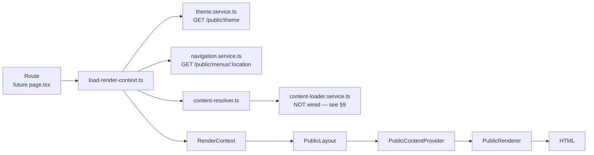

# 74_PUBLIC_RENDERING_FOUNDATION.md

# Public Rendering Foundation (Frontend Milestone 13.1)

- **Scope:** `apps/web/src/features/public/` — the rendering pipeline every future public page will pass through. Foundation only: no Homepage Builder, no Block Engine, no Visual Builder, and no existing route was replaced.
- **Status:** Awaiting Review
- **Related:** `41_PLATFORM_CAPABILITIES.md` (product vision this pipeline eventually serves), `53_API_FREEZE.md` (response envelope), `56_ADMIN_FRONTEND_ARCHITECTURE.md` (the sibling app this one's provider/hook conventions mirror), `69_BACKEND_PAGES.md`, `71_BACKEND_MENUS.md`, `72_BACKEND_THEMES.md`, `51_SEO_ARCHITECTURE.md`.

---

## 1. Architecture

The milestone brief's target pipeline:

```
Route → Resolver → Content Loader → Theme Loader → Renderer → HTML
```

This milestone builds every stage of that pipeline as real, working code — but two of its five stages (**Content Loader** for Page/Article/Category, and the **Site/Settings** loaders `PublicContentProvider` also needs) have no backend endpoint to call yet. See §9 "Known Limitations" before reading §2–§8; it changes what "real" means for several files below.

Rule Zero was followed throughout: every type, endpoint path, and field name in this milestone is verified against real backend code (`apps/backend/src/modules/**`) or the real, frozen Prisma schema. Nothing is invented. Where the real backend doesn't yet support something the brief asked for, this milestone says so explicitly (in code comments and in §9) rather than fabricating it.

---

## 2. Rendering Pipeline



1. **Route** — a future page/layout Server Component (not built this milestone).
2. **Resolver** (`resolver/content-resolver.ts`) — given a pathname, decides whether it names a Page, Article, or Category, and delegates to the matching Content Loader.
3. **Content Loader** (`services/content-loader.service.ts`) — would fetch the resolved Page/Article/Category. Currently always throws `PublicContentUnavailableError` (§9).
4. **Theme Loader** (`services/theme.service.ts`) — fetches the real `GET /public/theme`.
5. **Renderer** (`renderer/renderer.tsx`) — takes the assembled `RenderContext` and returns React nodes via a type→component registry.

`load-render-context.ts` runs the Theme Loader, the three `NavigationProvider` menu fetches, and the Resolver in parallel (`Promise.all`), then assembles one `RenderContext` object — the single source of truth every downstream component reads from.

---

## 3. Folder Structure

```
apps/web/src/features/public/
  types/            — PublicTheme, PublicMenu(Item), PublicSeo, ResolvedPublicContent, RenderContext
  constants/        — real route paths, menu-location convention, cache/locale defaults
  utils/            — pure transforms (CSS variables, envelope unwrap, URL-shape matcher), error classes
  services/         — real fetch calls (theme, navigation) + honest not-wired stubs (content, site, settings)
  resolver/         — content-resolver.ts (URL → ResolvedPublicContent, no JSX)
  providers/        — ThemeProvider, NavigationProvider, PublicContentProvider (data + context, no fetching)
  hooks/            — useTheme, useNavigation, usePublicContent, useRenderContext
  renderer/          — PublicRenderer + registry + Page/Article/NotFound/Unavailable renderers + load-render-context.ts
  components/       — PublicLayout, PublicLoading, PublicError, PublicNotFound
```

Also touched at the app level: `package.json` (scripts/deps), `tsconfig.json` (`@/*` alias), `next.config.ts`, `vitest.config.mts` + `vitest.setup.ts`, `src/lib/env.ts`, `.env.local`; and the repo-root `eslint.config.js` (extended the existing Next.js lint block to also cover `apps/web`).

---

## 4. Data Flow

| Data                  | Real endpoint                 | Loader                                          | Cache boundary                                                                        |
| --------------------- | ----------------------------- | ----------------------------------------------- | ------------------------------------------------------------------------------------- |
| Theme                 | `GET /public/theme`           | `theme.service.ts` → `getActiveTheme()`         | `react`'s `cache()` (per-request dedupe) + `fetch(..., { next: { revalidate: 60 } })` |
| Navigation            | `GET /public/menus/:location` | `navigation.service.ts` → `getMenuByLocation()` | same as Theme                                                                         |
| Page/Article/Category | **none exists**               | `content-loader.service.ts`                     | n/a — always throws `PublicContentUnavailableError`                                   |
| Site                  | **none exists**               | `site.service.ts`                               | n/a — always throws                                                                   |
| Settings              | **none exists**               | `settings.service.ts`                           | n/a — always throws                                                                   |

A 404 from the two real endpoints (`NoActiveThemeException` / `MenuNotFoundException` — both legitimate "nothing published yet" states, not failures) resolves to `null`, not a thrown error. Any other failure (network error, 5xx, malformed envelope) throws `PublicApiError`.

---

## 5. Provider Flow

```
PublicContentProvider (context: RenderContext)
 ├─ exposes { site, settings, locale, seo, content } via PublicContentContext
 ├─ ThemeProvider (theme: PublicTheme | null)
 │   └─ exposes { theme, cssVariables } via ThemeContext
 └─ NavigationProvider (menus: PublicNavigationMenus)
     └─ exposes { header, footer, secondary } via NavigationContext
```

All three are thin Client Components (`'use client'`) that hold already-resolved data in React Context — **none of them fetch**. `PublicLayout` (a Server Component) calls `load-render-context.ts` server-side, then mounts this one provider tree once per page. `hooks/use-theme.ts`, `use-navigation.ts`, and `use-public-content.ts` are the only sanctioned way a descendant Client Component reads this data; each throws a clear error if used outside its provider (mirrors `apps/admin/src/providers/settings-provider.tsx`'s `useAppSettings()` convention). `use-render-context.ts` composes all three into the full `RenderContext` shape for a component that wants everything at once.

---

## 6. Resolver Flow

```
resolveContent(pathname)
 ├─ matchContentRoute(pathname)   — pure URL-shape match: /page/{slug} /article/{slug} /category/{slug}
 │    no match → { type: 'not-found', path }
 └─ match found → calls the matching Content Loader
      ├─ throws PublicContentUnavailableError → { type: 'unavailable', path, reason }
      └─ (once a loader is real) → returns the real PublicPageContent / PublicArticleContent / PublicCategoryContent
```

`matchContentRoute`'s three prefixes come from `41_PLATFORM_CAPABILITIES.md`'s "Routing Engine" section — the only documented routing convention in this codebase. No backend route registry or config endpoint exists to resolve this from instead (that future capability is the "Routing Engine" milestone itself). This matcher is a frontend-only convention, not a mirror of any backend contract, and should be revisited once that milestone is scoped.

---

## 7. Renderer Flow

`renderer/renderer-registry.ts` maps `ResolvedPublicContent['type']` → component. This milestone registers exactly three (`page`, `article`, `not-found`, per the brief's "For this milestone support Page, Article, 404 only"). Any other resolved type (`category`, `unavailable`) falls back to `UnavailableRenderer` — a single shared "can't show this yet" component, not a silent crash. `PublicRenderer` is the only place that reads the registry; adding a future content type (Category, and eventually Block/Widget output) is one new registry entry, never a new branch inside `PublicRenderer` itself.

`PageRenderer`/`ArticleRenderer` render real fields only (title, subtitle, author, category, SEO description) and treat `body` (the `Page`/`Article` model's opaque JSON column) as an inert placeholder — turning that JSON into HTML is Block/Rich-Content Engine work, explicitly out of scope for this milestone.

---

## 8. Future Integration

- **Category rendering** — add a `CategoryRenderer` and register `category` once a milestone asks for it; the resolver already produces the type.
- **Public Pages/Articles/Categories/Site/Settings endpoints** — see §9. Once added (mirroring `PublicMenusController`/`PublicThemesController`'s `@Public()` pattern), `content-loader.service.ts`/`site.service.ts`/`settings.service.ts` stop throwing and start fetching — no other file in this milestone needs to change shape.
- **Layout Engine → Block Engine → Visual Builder → AI Layout Generator** — each plugs into `RENDERER_REGISTRY` as new content types/components. `PublicRenderer`, `PublicLayout`, and every provider stay unchanged; only the registry grows.
- **Header/Footer** — `PublicLayout` has marked, commented insertion points (`context.menus.header`/`context.menus.footer` are already resolved and available).
- **Route migration** — a future page.tsx calls `load-render-context.ts` with its pathname and renders `<PublicLayout context={...} />`; existing `apps/web` routes are untouched by this milestone.

---

## 9. Known Limitations

This is the most important section of this document.

**No public read endpoint exists for Pages, Articles, Categories, Site, or Settings.** Verified by reading every controller in `apps/backend/src/modules/**`: a global `JwtAuthGuard` (`apps/backend/src/app.module.ts`) requires a valid access token on every route by default; only a route explicitly decorated `@Public()` bypasses it. Exactly two `@Public()` controllers exist in the entire backend — `PublicMenusController` (`/public/menus/*`) and `PublicThemesController` (`/public/theme`). `PagesController`, `ArticlesController`, `CategoriesController`, and `SettingsController` are all gated by `PermissionGuard` + a specific permission (`page.manage`, one of the 4 `article.*` permissions, `category.create`, `settings.manage`) at the class level — an anonymous visitor's request can never satisfy those guards. No `Site` read endpoint exists at all; `PublicThemesService`/`PublicMenusService` resolve "the current site" internally via a private `getDefaultSite()` call, never over HTTP.

Concretely, this means:

| Milestone brief asked for                                   | What was built instead                                                                                                                           |
| ----------------------------------------------------------- | ------------------------------------------------------------------------------------------------------------------------------------------------ |
| `PublicContentProvider` loads current site                  | `site.service.ts` — typed seam, always throws `PublicContentUnavailableError`                                                                    |
| `PublicContentProvider` loads public settings               | `settings.service.ts` — same                                                                                                                     |
| `ContentResolver` resolves Page/Article/Category from a URL | Real URL-shape matching + real seam to a loader; the loader itself always throws until a `Public*Controller` exists for each                     |
| Renderer renders real Page/Article content                  | `PageRenderer`/`ArticleRenderer` are real, tested components — they render correctly once given real data, but no route can supply that data yet |

**This was a deliberate choice, not an oversight.** Per Rule Zero ("Never invent APIs... Only consume real backend endpoints"), inventing a `GET /public/pages/:slug` response shape and building against it would have meant fabricating an API contract. Instead, every seam that can't be real yet fails loudly and specifically (naming exactly which controller/permission blocks it and what backend change would unblock it), rather than silently returning fake data or crashing with a generic error.

**The recommended next backend milestone** is a `Public*Controller` for Pages, Articles, and Categories mirroring `PublicMenusController`/`PublicThemesController` exactly (separate controller, `@Public()`, no guards, reusing the existing repository/mapper — see either existing controller's own doc comment for the reasoning), plus a minimal public Site/Settings read surface exposing only what a public renderer needs (not the full admin `SettingsController` surface). Until then, every real public page this app can render is limited to whatever `theme`/`menus` data supplies — no Page, Article, or Category page can go live end-to-end.

**Other limitations, all in-scope and intentional:**

- `RenderContext.site`/`RenderContext.settings` are typed `null` (not an interface with guessed fields) — see §4.
- `body` (Page/Article) is rendered as an inert placeholder, never parsed — Block Engine is explicitly out of scope.
- `matchContentRoute`'s three URL prefixes are a frontend convention (§6), not a backend contract — expect them to change once a real Routing Engine milestone is scoped.
- No Header/Footer components exist — `PublicLayout` only marks where they'll go (§8).
- `docs/README.md`'s documentation index was not updated — it was already frozen at Milestone 7 and has no entries for Milestones 8–13; fixing that predates and is out of scope for this milestone.

---

## Cross References

- `41_PLATFORM_CAPABILITIES.md` — "Dynamic Pages", "Homepage Builder", "Widget System", "Routing Engine", "Theme Engine" (the product vision this pipeline serves, still V2/V3 in scope per `35_ARCHITECTURE_FREEZE.md`).
- `53_API_FREEZE.md` — response envelope (`ApiEnvelope`) this app's `unwrapEnvelope` mirrors.
- `69_BACKEND_PAGES.md` / `71_BACKEND_MENUS.md` / `72_BACKEND_THEMES.md` — the real backend modules this milestone reads from (or, for Pages, cannot yet).
- `51_SEO_ARCHITECTURE.md` — `PublicSeo`'s field source (`PageSeoDto`/`ArticleSeoDto`/`CategorySeoDto`).
- `56_ADMIN_FRONTEND_ARCHITECTURE.md` — the sibling app whose provider/hook/service conventions this milestone mirrors (adapted for Server Components instead of a client-only SPA).
